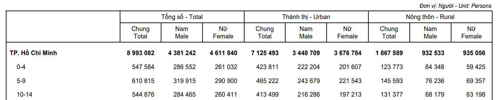

## Constant

Path to data:

```{r}
path2data <- paste0("C:/Users/ongph/github/data")
```

Files names:

```{r}
# Case notification
cases_file <- "measles/measles_cases_2019-12.2025.xlsx"

# Vaccination coverage
vax_hcmc_file <- "vax/vaxreg_hcmc_measles.rds"

# Population metadata
map_hcmc_file <- "map/gadm41_hcmc_district.rds"
census_file <- "census2019_hcm.rds"
```

## Packages

Required packages:

```{r}
required <- c("openxlsx", "janitor", "tidyverse", "lubridate", "stringi", "sf")

# Installing those that are not installed yet:
to_install <- required[! required %in% installed.packages()[, "Package"]]
if (length(to_install)) install.packages(to_install)

# Loading the packages for interactive use:
invisible(sapply(required, library, character.only = TRUE))
```

## Functions

Clean Vietnamese district name

```{r}
clean_district <- function(x) {
  x |>
    stri_trans_general("Latin-ASCII") |> 
    str_to_lower() |>                      
    str_squish() |>                        
    str_replace_all("đ", "d") |>
    str_remove("^(quan |huyen |thanh pho |tp )")
}
```

## Data

Census:

```{r}
df_census <- file.path(path2data, census_file) |>
  readRDS() |>
  mutate(district = clean_district(district))
```

Case report data:

```{r}
df_case <- file.path(path2data, cases_file) |>
  read.xlsx(sheet = 4) |>
  clean_names() |>
  mutate(
    ngay_nv = as.Date(as.numeric(ngay_nv), origin = "1899-12-30"),
    ngay_sinh = as.Date(as.numeric(ngay_sinh), origin = "1899-12-30"),
    age = time_length(interval(ngay_sinh, ngay_nv), "year"),
    district = clean_district(quan_huyen)
  )
```

Vaccination coverage:

```{r}
df_vax_hcmc <- file.path(path2data, vax_hcmc_file) |>
  readRDS() |>
  mutate(district = clean_district(district))
```

## Models that translate vaccination to immunity

The HCMC immunisation registry provides a snapshot of the vaccination status of all registered individuals, recording the date of birth and the date of administration of each dose of a measles-containing vaccine (MCV), from which age at vaccination and total dose count are derived. Translating vaccination records into an age-stratified, population-level immunity profile is termed "effective vaccine coverage" (EVC) [@kumar2023; @shattock2024].

> "The proportion of a population/cohort effectively vaccinated against measles, i.e. an indicator of population immunity. It discounts individuals ineffectively vaccinated, i.e. those who are vaccinated but still susceptible to infection." [@kumar2023]

Depending on the available immunity data, protection can be modelled using either a binary or a continuous (titre) approach:

- Vaccine efficacy: modelling the proportion of the population that is immune.
- Antibody titres: modelling individual titre dynamics, then aggregating them to form an age-stratified immunity profile.

Waning immunity and age-at-vaccination dependence can be incorporated into both frameworks. Since longitudinal titre data for the measles vaccine remain limited, this thesis uses the binary approach.

### Static coverage

The simplest model assumes vaccine efficacy (VE) remains constant over time. EVC is a weighted sum across mutually exclusive dosage strata, with weights given by the efficacy of each stratum [@kumar2023].

$$EVC = c_{\text{1 only}} \times VE_1 + c_{2+} \times VE_2$$

- $c_{\text{1 only}}$ = proportion with 1 dose only
- $c_{2+}$ = proportion with $\geq 2$ doses
- $VE_1, VE_2$ = vaccine efficacy per stratum

### Waning immunity

If waning immunity is considered and longitudinal efficacy data are available (e.g. initial efficacy, efficacy after $t$ years, efficacy half-life), efficacy at time $t$ can be modelled using an exponential decay function, where $\alpha$ represents initial efficacy and $\beta$ represents the decay rate fitted from empirical data [@shattock2024].

$$VE(t) = \alpha \times e^{-\beta t}$$

EVC for a cohort of age $a$ in year $y$ is estimated by computing the cumulative probability of remaining unprotected despite multiple annual vaccination opportunities.

$$EVC(y, a) = 1 - \prod_{i=y-a}^{y} \big( 1 - c(i, \text{age}_{i}) \times VE(y - i) \big)$$

- $i$ = historical calendar year (iterating from birth year $y-a$ to current year $y$)
- $c(i, \text{age}_{i})$ = historical vaccine coverage in year $i$ for the cohort's age at that time
- $VE(y-i)$ = residual efficacy after $y-i$ years have elapsed

### Age-at-vaccination dependence

For vaccines where efficacy depends on age at vaccination — including the measles vaccine - both the initial efficacy and the decay rate may vary with $\text{age}_{vax}$:

$$VE(t, \text{age}_{vax}) = \alpha(\text{age}_{vax}) \times e^{-\beta(\text{age}_{vax})\, t}$$

$$EVC(y, a) = 1 - \prod_{i=y-a}^{y} \big( 1 - c(i, \text{age}_{i}) \times VE(y - i, \text{age}_{i}) \big)$$

### Individual-level extension for registry data

The formulations above were developed for settings where only annual cohort coverage $c(i, \text{age}_i)$ is observed. They rely on two approximations:

- Time discretised at calendar-year resolution
- Coverage represented as a cohort-level proportion. Aggregate coverage tells us how many people got each dose, but not which people got which doses, or at what age. The joint distribution must be inferred from these marginals, which is called "between-dose correlation" (BdC) [@kumar2023].

The HCMC registry contains data at individual resolution, which removes both approximations. For an individual $j$ with date of birth $b_j$ and doses administered at dates $t_{j,1}, \ldots, t_{j,k_j}$, the per-individual protection probability at evaluation date $T$ is:

$$P_j(T) = 1 - \prod_{d=1}^{k_j} \big( 1 - VE(\tau_{j,d}, \, a_{j,d}) \big)$$

where $a_{j,d} = t_{j,d} - b_j$ is the age at dose $d$ and $\tau_{j,d} = T - t_{j,d}$ is the time elapsed since dose $d$. For unvaccinated individuals $VE = 0$. This is similar to using a leaky model for vaccine effect.

$$VE(\tau, a) = \max\!\big(0,\; \alpha(a)\, e^{-\beta(a)\,\tau}\big)$$

Cohort-level EVC for a birth-date interval $\mathcal{B}$ is then the average over individuals in that cohort:

$$EVC(T; \mathcal{B}) = \frac{1}{|\mathcal{B}|} \sum_{j: b_j \in \mathcal{B}} P_j(T)$$

## Other frameworks

### Static birth cohort model

This one answer another question. Given that we know the current snapshot of population immunity profile (either from seroprevalence or the EVC), we want to make projections of how the future population immunity profile would look like, given some assumption about vaccination uptake in the future. The output is projected immunity levels [@funk2019; @mburu2021].

## Parameters

Initial efficacy $\alpha(a)$ for age strata below 9 months is taken from seroconversion estimates [@lochlainn2019], as clinical vaccine effectiveness estimates are unavailable at these ages. For age strata at 9 months and older, $\alpha(a)$
is taken from clinical VE estimates [@uzicanin2011; @who2017; @franconeri2023] which approximate efficacy shortly after vaccination. For simplicity, we use the same exponential waning rate $\beta$ from [@franconeri2023] for all age strata.

| Parameter | Best estimate | 95% CI / range | Source |
|------------------|------------------|------------------|------------------|
| Seroconversion MCV1, 4 mo | 50% | 29-71% | [@lochlainn2019] |
| Seroconversion MCV1, 5 mo | 67% | 51-81% | [@lochlainn2019] |
| Seroconversion MCV1, 6 mo | 76% | 71-82% | [@lochlainn2019] |
| Seroconversion MCV1, 7 mo | 72% | 56-87% | [@lochlainn2019] |
| Seroconversion MCV1, 8 mo | 85% | 69-97% | [@lochlainn2019] |
| VE MCV1, 9-11 mo | 84.0% | 72.0-95.0% | [@uzicanin2011; @who2017] |
| VE MCV1, \>=12 mo | 92.5% | 84.8-97.0% | [@uzicanin2011; @who2017] |
| VE MCV2 | 99.6% | 99.3-99.8% | [@franconeri2023] |
| Annual waning (proportion seroreverting) | 0.0022/yr | 0.0017-0.0028/yr | [@franconeri2023] |

## Immunity profile of HCMC children

### Vaccine efficacy function 

```{r}
DAYS_PER_MONTH <- 365.25 / 12
DAYS_PER_YEAR  <- 365.25

# Parameter table
ve_params <- tibble(
  stratum     = c("MCV1, 4 mo", "MCV1, 5 mo", "MCV1, 6 mo",
                  "MCV1, 7 mo", "MCV1, 8 mo",
                  "MCV1, 9 to 11 mo", "MCV1, >= 12 mo",
                  "MCV2"),
  dose        = c(rep(1, 7), 2),
  age_lo_days = c(4, 5, 6, 7, 8, 9, 12, 12) * 30.44,
  age_hi_days = c(5, 6, 7, 8, 9, 12, Inf, Inf) * 30.44,
  alpha       = c(0.50, 0.67, 0.76, 0.72, 0.85, 0.84, 0.925, 0.996),
  alpha_lo    = c(0.29, 0.51, 0.71, 0.56, 0.69, 0.72, 0.848, 0.993),
  alpha_hi    = c(0.71, 0.81, 0.82, 0.87, 0.97, 0.95, 0.970, 0.998)
)

# Waning rate and CI
beta_central <- list(yr = 0.0022, lo = 0.0017, hi = 0.0028)

# Parameter sampling

# Match Beta distribution to mean and 95% CI by moment-matching
# Approximation: treat (hi - lo) / (2 * 1.96) as the SD
fit_beta_params <- function(mean, lo, hi) {
  sd  <- (hi - lo) / (2 * 1.96)
  var <- sd^2
  # Method-of-moments for Beta(a, b)
  a <- mean * (mean * (1 - mean) / var - 1)
  b <- (1 - mean) * (mean * (1 - mean) / var - 1)
  list(shape1 = a, shape2 = b)
}

# Match LogNormal to mean and 95% CI for the waning rate
fit_lnorm_params <- function(mean, lo, hi) {
  # On the log scale, treat reported lo/hi as 2.5% and 97.5% quantiles
  meanlog <- log(mean)
  sdlog   <- (log(hi) - log(lo)) / (2 * 1.96)
  list(meanlog = meanlog, sdlog = sdlog)
}

# Draw n_draws parameter sets
draw_parameters <- function(n_draws, params = ve_params,
                            beta_info = beta_central, seed = 42) {
  set.seed(seed)
  
  # Draws of alpha for each stratum
  alpha_draws <- params |>
    rowwise() |>
    mutate(
      beta_dist = list(fit_beta_params(alpha, alpha_lo, alpha_hi)),
      draws     = list(rbeta(n_draws, beta_dist$shape1, beta_dist$shape2))
    ) |>
    ungroup() |>
    select(stratum, draws) |>
    unnest_wider(draws, names_sep = "_") |>
    pivot_longer(starts_with("draws_"),
                 names_to = "draw", values_to = "alpha_draw") |>
    mutate(draw = as.integer(str_remove(draw, "draws_")))
  
  # Draws of beta (per year)
  lnp <- fit_lnorm_params(beta_info$yr, beta_info$lo, beta_info$hi)
  beta_draws <- tibble(
    draw    = 1:n_draws,
    beta_yr = rlnorm(n_draws, lnp$meanlog, lnp$sdlog)
  )
  
  alpha_draws |>
    left_join(beta_draws, by = "draw") |>
    mutate(beta_day = beta_yr / DAYS_PER_YEAR)
}

# ---- VE function (parameterised) ----------------------------------------

# Now takes alpha and beta_day as arguments rather than referencing globals.
# Looks up alpha from a per-draw parameter table by stratum.

ve_function <- function(age_days, tau_days, dose, draw_params) {
  
  # draw_params: tibble with one row per stratum giving alpha and beta_day
  
  stratum_lookup <- tibble(age_days, dose) |>
    mutate(stratum = case_when(
      dose == 2                       ~ "MCV2",
      age_days < 5  * DAYS_PER_MONTH  ~ "MCV1, 4 mo",
      age_days < 6  * DAYS_PER_MONTH  ~ "MCV1, 5 mo",
      age_days < 7  * DAYS_PER_MONTH  ~ "MCV1, 6 mo",
      age_days < 8  * DAYS_PER_MONTH  ~ "MCV1, 7 mo",
      age_days < 9  * DAYS_PER_MONTH  ~ "MCV1, 8 mo",
      age_days < 12 * DAYS_PER_MONTH  ~ "MCV1, 9 to 11 mo",
      TRUE                            ~ "MCV1, >= 12 mo"
    ))
  
  joined <- stratum_lookup |>
    left_join(draw_params, by = "stratum")
  
  pmax(0, joined$alpha_draw * exp(-joined$beta_day * tau_days))
}

# ---- EVC computation with parameter uncertainty -------------------------

compute_evc_mc <- function(roster, doses, eval_date, n_draws = 1000,
                           lag = 14) {
  
  param_draws <- draw_parameters(n_draws)
  
  # Pre-compute per-dose age and tau (constant across draws)
  dose_data <- doses |>
    inner_join(roster |> select(id, dob), by = "id") |>
    mutate(
      age_days = as.numeric(dose_date - dob),
      tau_days = pmax(0, as.numeric(eval_date - dose_date) - lag)
    )
  
  # Loop over draws; could be parallelised with furrr::future_map_dfr
  map_dfr(1:n_draws, function(d) {
    
    draw_params_d <- param_draws |> filter(draw == d)
    
    per_dose_ve <- dose_data |>
      mutate(ve = ve_function(age_days, tau_days, dose, draw_params_d))
    
    per_individual <- per_dose_ve |>
      group_by(id) |>
      summarise(P = 1 - prod(1 - ve), .groups = "drop")
    
    roster |>
      left_join(per_individual, by = "id") |>
      mutate(P = coalesce(P, 0)) |>
      summarise(draw = d, evc = mean(P))
  })
}

# ---- Summarise to point estimate and CI ---------------------------------

summarise_evc <- function(evc_distribution) {
  evc_distribution |>
    summarise(
      median = median(evc),
      lower  = quantile(evc, 0.025),
      upper  = quantile(evc, 0.975),
      n_draws = n()
    )
}
```


```{r}
#| fig-width: 6.5
#| fig-height: 3.5

# Build VE curves from Monte Carlo parameter draws -----------------------

build_ve_mc_curves <- function(n_draws = 1000, tau_max_yr = 15,
                               tau_n = 200) {
  
  param_draws <- draw_parameters(n_draws)  # from previous block
  tau_grid    <- seq(0, tau_max_yr, length.out = tau_n)
  
  # Cross-join all draws with the tau grid, compute VE
  param_draws |>
    crossing(tau_yr = tau_grid) |>
    mutate(ve = pmax(0, alpha_draw * exp(-beta_yr * tau_yr))) |>
    group_by(stratum, tau_yr) |>
    summarise(
      ve_med = median(ve),
      ve_lo  = quantile(ve, 0.025),
      ve_hi  = quantile(ve, 0.975),
      .groups = "drop"
    ) |>
    left_join(ve_params |> select(stratum, dose), by = "stratum") |>
    mutate(
      dose_label = if_else(dose == 1, "MCV1", "MCV2"),
      stratum    = factor(stratum, levels = ve_params$stratum)
    )
}

ve_mc <- build_ve_mc_curves(n_draws = 1000, tau_max_yr = 15)

# Endpoint markers for direct labelling
endpoints_mc <- ve_mc |>
  group_by(stratum) |>
  filter(tau_yr == max(tau_yr)) |>
  ungroup()

palette <- c(
  "MCV1, 4 mo"        = "#A50026",
  "MCV1, 5 mo"        = "#D73027",
  "MCV1, 6 mo"        = "#F46D43",
  "MCV1, 7 mo"        = "#FDAE61",
  "MCV1, 8 mo"        = "#74ADD1",
  "MCV1, 9 to 11 mo"  = "#4575B4",
  "MCV1, >= 12 mo"    = "#313695",
  "MCV2"              = "#B8860B"
)

p_mc <- ggplot(ve_mc,
               aes(x = tau_yr, y = ve_med,
                   colour = stratum, fill = stratum,
                   linetype = dose_label)) +
  geom_ribbon(aes(ymin = ve_lo, ymax = ve_hi),
              alpha = 0.15, colour = NA) +
  geom_line(linewidth = 0.85) +
  geom_point(data = endpoints_mc, size = 1.8) +
  geom_text(
    data = endpoints_mc,
    aes(label = scales::percent(ve_med, accuracy = 0.1)),
    hjust = -0.2, size = 2.9, show.legend = FALSE
  ) +
  scale_y_continuous(
    labels = scales::percent_format(accuracy = 1),
    limits = c(0, 1),
    breaks = seq(0, 1, 0.2),
    expand = expansion(mult = c(0, 0.02))
  ) +
  scale_x_continuous(
    breaks = seq(0, 15, 3),
    limits = c(0, 17),
    expand = expansion(mult = c(0.005, 0))
  ) +
  scale_colour_manual(values = palette, name = "Stratum") +
  scale_fill_manual(values = palette, name = "Stratum") +
  scale_linetype_manual(values = c("MCV1" = "solid", "MCV2" = "dashed"),
                        name = "Dose") +
  labs(
    x = "Years since vaccination",
    y = "Vaccine efficacy"
  ) +
  guides(
    colour   = guide_legend(order = 1, ncol = 1, reverse = TRUE),
    fill     = guide_legend(order = 1, ncol = 1, reverse = TRUE),
    linetype = guide_legend(order = 2,
                            override.aes = list(colour = "grey30"),
                            reverse = TRUE)
  ) +
  theme_minimal(base_size = 11) +
  theme(
    plot.title.position  = "plot",
    plot.title           = element_text(face = "bold", size = 12,
                                        margin = margin(b = 4)),
    plot.subtitle        = element_text(colour = "grey40", size = 9.5,
                                        margin = margin(b = 14)),
    legend.position      = "right",
    legend.title         = element_text(size = 10, face = "bold"),
    legend.text          = element_text(size = 9),
    legend.key.width     = unit(1.6, "lines"),
    legend.spacing.y     = unit(0.3, "lines"),
    panel.grid.minor     = element_blank(),
    panel.grid.major     = element_line(colour = "grey93"),
    axis.title           = element_text(colour = "grey25"),
    axis.title.x         = element_text(margin = margin(t = 10)),
    axis.title.y         = element_text(margin = margin(r = 10)),
    axis.text            = element_text(colour = "grey30"),
    plot.margin          = margin(15, 20, 12, 15)
  )

p_mc
```

### Immunity profile


## Cohort of children from vaccine registry

Confirm with 2019 census data. Age in census data ranged from 1-81.

```{r}
summary(df_census$age)
```



```{r}
df_census |>
  mutate(
    band = case_when(
      age %in% 1:5   ~ "1-5",
      age %in% 6:10  ~ "6-10",
      age %in% 11:15 ~ "11-15"
    )
  ) |>
  filter(!is.na(band)) |>
  group_by(band) |>
  summarise(total = sum(n))
```

The 2019 census used pre-merger districts, while registry data have merged districts 2, 9, Thu Duc into Thu Duc:

```{r}
setdiff(unique(df_census$district), unique(df_vax_hcmc$district))
```

So let's merge 2, 9, Thu Duc into Thu Duc

```{r}
census_aligned <- df_census |>
  mutate(district = if_else(district %in% c("2", "9", "thu duc"), "thu duc", district)) |>
  filter(age %in% 1:3) |>
  group_by(district, age) |>
  summarise(n_census = sum(n), .groups = "drop")

setdiff(unique(df_vax_hcmc$district),
        unique(census_aligned$district))
setdiff(unique(census_aligned$district),
        unique(df_vax_hcmc$district))
```

The 2019 census was conducted on 01/04/2019.

```{r}

```

## Assumption

The hypothesis is registry is comprehensive (just like how HCDC believed). If so, registry can inform:

- Susceptibility

Vaccine effectiveness of MCV1:
