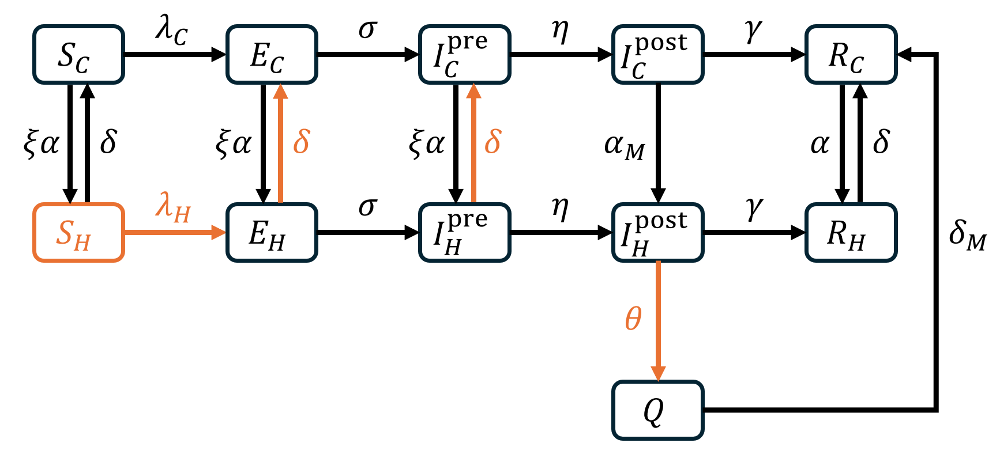

## Constant

Path to data:

```{r}
if (Sys.getenv("USER") == "MarcChoisy" | Sys.getenv("USER") == "marc") {
  path2data <- paste0("~/Library/CloudStorage/OneDrive-OxfordUniversityClinical",
                      "ResearchUnit/SharePoint/OUCRU Modelling/Thinh's DPhil")
} else {
  path2data <- "C:/Users/ongph/github/data/dphil_res3"
}
```

Files names:

```{r}
# Case notification
case_hcmc <- "measles_hcmc_24-25.rds"
case_hn <- "measles_hn_final.rds"
case_ch2 <- "clinical_cases_ch2.rds"

# Census of HCMC
census_file <- "census2019_hcm.rds"

# Campaign HCMC
campaign_file <- "campaign_hcmc_2425.csv"

# CH1 outpatient
ch1_out_file <- "ch1_visit_day.rds"
```

## Packages

```{r, message=FALSE}
required <- c("tidyverse", "fitdistrplus", "ggsci", "BayesianTools", "deSolve",
              "BayesianTools", "patchwork")

# Installing those that are not installed yet:
to_install <- required[! required %in% installed.packages()[, "Package"]]
if (length(to_install)) install.packages(to_install)

# Loading the packages for interactive use:
invisible(sapply(required, library, character.only = TRUE))
```

## Functions

```{r}
plot_interval <- function(data, var, trim = 0.99, xlab = "days", ylab = "cases") {
  x <- dplyr::pull(data, {{ var }})
  x <- x[!is.na(x)]

  stats <- tibble(stat = c("mean", "median"),
                  value = c(mean(x), median(x)))

  ggplot(data, aes({{ var }})) +
    geom_histogram(binwidth = 1, boundary = -0.5,
                   fill = "grey80", colour = "white") +
    geom_vline(data = stats, aes(xintercept = value, colour = stat, linetype = stat),
               linewidth = 0.7) +
    scale_colour_manual(values = c(mean = "black", median = "grey40")) +
    scale_linetype_manual(values = c(mean = 1, median = 2)) +
    coord_cartesian(xlim = quantile(x, c(0, trim))) +
    labs(x = xlab, y = ylab, colour = NULL, linetype = NULL) +
    theme_classic() +
    theme(legend.position = "top")
}
```

## Data

Census:

```{r}
df_census <- file.path(path2data, census_file) |> 
  readRDS()
```

Case notification HCMC (for calibration):

```{r}
df_hcmc <- file.path(path2data, case_hcmc) |> 
  readRDS() |> 
  mutate(
    ngay_kp = as.Date(as.numeric(ngay_kp), origin = "1899-12-30"),
    onset_delay = ngay_nv - ngay_kp,
    inpatient = if_else(tinh_trang == "Điều trị ngoại trú", F, T)
  )
```

National Children's Hospital line list:

```{r}
df_hn <- file.path(path2data, case_hn) |>
  readRDS() |> 
  mutate(
    discharge_date = dmy(date.of.out.hospital),
    admission_date = dmy(admission_date),
    # Clean one row with discharge - admission = -358
    discharge_date = if_else(
      between(as.numeric(discharge_date - admission_date), -366, -300),
      discharge_date %m+% years(1),
      discharge_date,
      missing = discharge_date
    ),
    stay = discharge_date - admission_date,
    onset_delay = admission_date - onset_date
  )
```

Children's Hospital 2 in HCMC

```{r}
df_ch2 <- file.path(path2data, case_ch2) |> 
  readRDS() |> 
  filter(
    year(admission) %in% c(2024, 2025)
  )
```

Vaccination campaign

```{r}
df_cp <- file.path(path2data, campaign_file) |> 
  read.csv() |> 
  mutate(
    total = total - health_worker
  )
```

Children's Hospital 1 outpatient

```{r}
df_ch1_out <- file.path(path2data, ch1_out_file) |> 
  readRDS()
```

## Model



$$\begin{aligned}
\frac{dS_C}{dt}
&= -\lambda_C S_C - \xi \alpha S_C + \delta S_H, \\[4pt]
\frac{dE_C}{dt}
&= \lambda_C S_C - (\sigma + \xi \alpha)E_C + \delta E_H, \\[4pt]
\frac{dI_C^{\mathrm{pre}}}{dt}
&= \sigma E_C - (\eta + \xi \alpha)I_C^{\mathrm{pre}}
   + \delta I_H^{\mathrm{pre}}, \\[4pt]
\frac{dI_C^{\mathrm{post}}}{dt}
&= \eta I_C^{\mathrm{pre}}
   - (\gamma + \alpha_M)I_C^{\mathrm{post}}, \\[4pt]
\frac{dR_C}{dt}
&= \gamma I_C^{\mathrm{post}}
   - \alpha R_C + \delta R_H + \delta_M Q.
\\[4pt]
\frac{dS_H}{dt}
&= \xi \alpha S_C - \lambda_H S_H - \delta S_H, \\[4pt]
\frac{dE_H}{dt}
&= \lambda_H S_H + \xi \alpha E_C - (\sigma + \delta)E_H, \\[4pt]
\frac{dI_H^{\mathrm{pre}}}{dt}
&= \sigma E_H + \xi \alpha I_C^{\mathrm{pre}}
   - (\eta + \delta)I_H^{\mathrm{pre}}, \\[4pt]
\frac{dI_H^{\mathrm{post}}}{dt}
&= \eta I_H^{\mathrm{pre}}
   + \alpha_M I_C^{\mathrm{post}}
   - (\gamma + \theta)I_H^{\mathrm{post}}, \\[4pt]
\frac{dQ}{dt}
&= \theta I_H^{\mathrm{post}} - \delta_M Q, \\[4pt]
\frac{dR_H}{dt}
&= \gamma I_H^{\mathrm{post}} + \alpha R_C - \delta R_H.
\end{aligned}$$

```{r}
state_names <- c("S_C", "E_C", "I_C_pre", "I_C_post", "R_C",
                 "S_H", "E_H", "I_H_pre", "I_H_post", "Q", "R_H",
                 "cum_onset_C", "cum_onset_H", "cum_noso",
                 "cum_adm_post", "cum_inf_C")
 
param_names <- c("beta", "kappa", "theta", "xi_alpha", "alpha",
                 "alpha_M", "delta_M", "sigma", "eta", "gamma", "delta")
 
measles_ode <- function(t, y, p) {
 
  ## ---- states --------------------------------------------------------------
  S_C <- y[["S_C"]]; E_C <- y[["E_C"]]
  I_C_pre <- y[["I_C_pre"]]; I_C_post <- y[["I_C_post"]]; R_C <- y[["R_C"]]
 
  S_H <- y[["S_H"]]; E_H <- y[["E_H"]]
  I_H_pre <- y[["I_H_pre"]]; I_H_post <- y[["I_H_post"]]
  Q <- y[["Q"]]; R_H <- y[["R_H"]]
 
  ## ---- parameters ----------------------------------------------------------
  beta     <- p[["beta"]]
  kappa    <- p[["kappa"]]
  theta    <- p[["theta"]]
  xi_alpha <- p[["xi_alpha"]]     # admission rate for susceptible-like states
  alpha    <- p[["alpha"]]        # admission rate for immune states
  alpha_M  <- p[["alpha_M"]]      # measles-driven admission, post-rash
  delta    <- p[["delta"]]        # general discharge
  delta_M  <- p[["delta_M"]]      # discharge from isolation
  sigma    <- p[["sigma"]]
  eta      <- p[["eta"]]
  gamma    <- p[["gamma"]]
 
  ## ---- forces of infection -------------------------------------------------
  N_C     <- S_C + E_C + I_C_pre + I_C_post + R_C
  N_H_mix <- S_H + E_H + I_H_pre + I_H_post + R_H      # Q is isolated
 
  lambda_C <- beta         * (I_C_pre + I_C_post) / N_C
  lambda_H <- kappa * beta * (I_H_pre + I_H_post) / N_H_mix
 
  ## ---- named flows ---------------------------------------------------------
  infection_C <- lambda_C * S_C          # new infections in the community
  infection_H <- lambda_H * S_H          # new infections in hospital
  onset_C     <- eta * I_C_pre           # rash appears, in the community
  onset_H     <- eta * I_H_pre           # rash appears, already an inpatient
  admit_rash  <- alpha_M * I_C_post      # admitted with rash present
  admit_prod  <- xi_alpha * I_C_pre      # admitted for another reason, prodromal
 
  ## ---- community -----------------------------------------------------------
  dS_C      <- -infection_C - xi_alpha * S_C + delta * S_H
  dE_C      <-  infection_C - (sigma + xi_alpha) * E_C + delta * E_H
  dI_C_pre  <-  sigma * E_C - onset_C - admit_prod + delta * I_H_pre
  dI_C_post <-  onset_C - gamma * I_C_post - admit_rash
  dR_C      <-  gamma * I_C_post - alpha * R_C + delta * R_H + delta_M * Q
 
  ## ---- hospital ------------------------------------------------------------
  dS_H      <-  xi_alpha * S_C - infection_H - delta * S_H
  dE_H      <-  infection_H + xi_alpha * E_C - (sigma + delta) * E_H
  dI_H_pre  <-  sigma * E_H + admit_prod - onset_H - delta * I_H_pre
  dI_H_post <-  onset_H + admit_rash - (gamma + theta) * I_H_post
  dQ        <-  theta * I_H_post - delta_M * Q
  dR_H      <-  gamma * I_H_post + alpha * R_C - delta * R_H
 
  ## ---- cumulative trackers -------------------------------------------------
  dcum_onset_C  <- onset_C
  dcum_onset_H  <- onset_H
  dcum_noso     <- infection_H
  dcum_adm_post <- admit_rash
  dcum_inf_C    <- infection_C
 
  list(c(dS_C, dE_C, dI_C_pre, dI_C_post, dR_C,
         dS_H, dE_H, dI_H_pre, dI_H_post, dQ, dR_H,
         dcum_onset_C, dcum_onset_H, dcum_noso, dcum_adm_post, dcum_inf_C))
}

# Model helpers

## initial state: disease-free split of each population, plus a community seed
init_state <- function(s_C0, s_H0, seed) {
  y <- c(S_C = s_C0 * N_C0 - seed,
         E_C = seed,
         I_C_pre = 0, I_C_post = 0,
         R_C = (1 - s_C0) * N_C0,
         S_H = s_H0 * N_H0,
         E_H = 0, I_H_pre = 0, I_H_post = 0, Q = 0,
         R_H = (1 - s_H0) * N_H0,
         cum_onset_C = 0, cum_onset_H = 0, cum_noso = 0,
         cum_adm_post = 0, cum_inf_C = 0)
  y[state_names]
}

## quantities implied by the sampled parameters
##   xi    odds ratio of susceptibility between hospital and community, so that
##         the disease-free state is a true fixed point
##   alpha admission rate for immune children, set so the population-weighted
##         rate equals the observed general admission rate alpha_bar
##   D_inf mean time a community case spends infectious, used to convert R_eff
derived <- function(par) {
  s_C0 <- par[["s_C0"]]
  s_H0 <- par[["s_H0"]]
 
  xi       <- (s_H0 * (1 - s_C0)) / (s_C0 * (1 - s_H0))
  alpha    <- alpha_bar / (1 + s_C0 * (xi - 1))
  xi_alpha <- xi * alpha
 
  D_inf <- 1 / (eta + xi_alpha) + 1 / (gamma + alpha_M)
 
  list(xi = xi, alpha = alpha, xi_alpha = xi_alpha, D_inf = D_inf,
       beta = par[["R_eff"]] / (D_inf * s_C0))
}
 
make_params <- function(par, d) {
  p <- c(beta = d$beta, kappa = par[["kappa"]], theta = theta_fixed,
         xi_alpha = d$xi_alpha, alpha = d$alpha,
         alpha_M = alpha_M, delta_M = delta_M,
         sigma = sigma, eta = eta, gamma = gamma, delta = delta)
  p[param_names]
}
 
solve_model <- function(par, times) {
  d <- derived(par)
  out <- tryCatch(
    ode(y      = init_state(par[["s_C0"]], par[["s_H0"]], par[["seed"]]),
        times  = times,
        func   = measles_ode,
        parms  = make_params(par, d),
        method = "lsoda", atol = 1e-3, rtol = 1e-6),
    error = function(e) NULL
  )
  if (is.null(out) || nrow(out) != length(times) || anyNA(out)) return(NULL)
  out
}
 
run_model <- function(par, n_weeks, full = FALSE) {
 
  out <- solve_model(par, seq.int(0L, n_weeks * 7L, by = 7L))
  if (is.null(out)) return(NULL)
 
  onset_C <- diff(out[, "cum_onset_C"])
  onset_H <- diff(out[, "cum_onset_H"])
  last    <- nrow(out)
 
  if (!full) {
    return(list(inc      = onset_C + onset_H,
                adm_pre  = out[last, "cum_onset_H"],
                adm_post = out[last, "cum_adm_post"]))
  }
 
  tibble(
    week     = seq_len(n_weeks),
    onset_C  = onset_C,
    onset_H  = onset_H,
    adm_pre  = onset_H,
    adm_post = diff(out[, "cum_adm_post"]),
    noso     = diff(out[, "cum_noso"]),
    inf_C    = diff(out[, "cum_inf_C"]),
    I_H_pre  = out[-1, "I_H_pre"],
    I_H_post = out[-1, "I_H_post"],
    N_H      = rowSums(out[-1, c("S_H", "E_H", "I_H_pre",
                                 "I_H_post", "Q", "R_H")]),
    s_H_t    = out[-1, "S_H"] / rowSums(out[-1, c("S_H", "E_H", "I_H_pre",
                                                  "I_H_post", "R_H")]),
    s_C_t    = out[-1, "S_C"] / rowSums(out[-1, c("S_C", "E_C", "I_C_pre",
                                                  "I_C_post", "R_C")])
  )
}
```

## Parameters

Disease natural history (rate per day)

```{r}
sigma <- 1 / 8      # exposed -> infectious
eta   <- 1 / 4      # pre-rash -> post-rash
gamma <- 1 / 4      # post-rash -> removed
theta_fixed <- 1
```

### alpha_bar

Number of children <= 15 year-old in HCMC ($N$):

```{r}
N <- df_census |>
  filter(age <= 15) |>
  pull(n) |>
  sum()

cat("Total population N:", N)
```

Children's Hospital 1 reported 90,000 admissions per year. Assume that the total HCMC
is 5 times CH1, but only 40% serve HCMC residents.

The mean length of stay of a child is reported as 5.2 days.

```{r}
resident_frac <- 0.4
alpha_bar <- 5 * resident_frac * 90000 / (N * 365)
delta <- 1 / 5.2
```

Number of inpatients in the hospital

```{r}
N_H0 <- round(alpha_bar * N / delta)
N_C0 <- N - N_H0
cat("Hospital population N_H0:", N_H0)
cat("Community population N_C0:", N_C0)
```

### alpha_M

Estimate onset to admission delay. Only Ha Noi data has this:

```{r}
d <- df_hn |>
  mutate(ad_delay = as.numeric(admission_date - onset_date)) |>
  filter(!is.na(ad_delay), ad_delay >= 0, ad_delay <= 10,
         source_province == "community", province == "Ha Noi")

est <- d |> summarise(
  n = n(),
  addelay_M = mean(ad_delay),
  median = median(ad_delay),
  sd = sd(ad_delay),
  se = sd(ad_delay) / sqrt(n())
)

est

plot_interval(d, ad_delay, trim = 0.99,
              xlab = "onset to admission delay (days)", ylab = "cases")

alpha_M <- 1/est$addelay_M
cat("alpha_M:", alpha_M)
```

### delta_M

Measles-driven admission rate is estimated from the length of stay of measles patients.

Children's Hospital 2 (HCMC):

```{r}
d <- df_ch2 |>
  mutate(stay = as.numeric(discharge - admission)) |>
  filter(!is.na(stay), stay >= 0, stay < 30)

est <- d |> summarise(
  n = n(),
  los_M = mean(stay),
  median = median(stay),
  sd = sd(stay),
  se = sd(stay) / sqrt(n())
)

est

plot_interval(d, stay, xlab = "length of stay (days)", ylab = "cases")

delta_M <- 1 / est$los_M
```


## Disease-free equilibrium check

```{r}
disease_free <- function(delta_use, s_C0 = 0.08, s_H0 = 0.293, days = 365) {
 
  par <- c(R_eff = 1.3, kappa = 0, theta = 1,
           s_C0 = s_C0, s_H0 = s_H0, seed = 0)
  d   <- derived(par)
 
  p <- make_params(par, d)
  p[["beta"]]  <- 0            # no transmission
  p[["delta"]] <- delta_use
 
  out <- ode(y = init_state(s_C0, s_H0, 0), times = 0:days,
             func = measles_ode, parms = p,
             method = "lsoda", atol = 1e-3, rtol = 1e-6)
 
  as.data.frame(out) |>
    as_tibble() |>
    transmute(
      day = time,
      N_H = S_H + E_H + I_H_pre + I_H_post + Q + R_H,
      s_H = S_H / (S_H + E_H + I_H_pre + I_H_post + R_H),
      s_C = S_C / (S_C + E_C + I_C_pre + I_C_post + R_C)
    )
}
 
bind_rows(
  disease_free(delta)) |> 
  ggplot(aes(day, N_H)) +
  geom_hline(yintercept = N_H0, linetype = "dashed") +
  geom_line(linewidth = 0.7) +
  ylim(c(0, 3000)) +
  labs(x = "Day", y = "Hospital population N_H", colour = NULL,
       subtitle = "Dashed line is the specified N_H(0)") +
  theme_minimal(base_size = 11) +
  theme(legend.position = "bottom")
```

## Calibration

Epidemic curve by inpatient/outpatient:

```{r}
df_week <- df_hcmc |>
  filter(age <= 15) |>
  mutate(
    date = as_date(ngay_nv),
    week = floor_date(date, "week", week_start = 1),
    type = if_else(inpatient, "inpatient", "outpatient")
  ) |>
  filter(!is.na(week), !is.na(type)) |>
  count(week, type, name = "cases") |>
  complete(
    week = seq(min(week), max(week), by = "week"),
    type,
    fill = list(cases = 0)
  )

df_week_wide <- df_week |>
  pivot_wider(names_from = type, values_from = cases, values_fill = 0) |>
  mutate(
    total          = inpatient + outpatient,
    prop_inpatient = inpatient / total
  ) |>
  arrange(week)

n_lead_weeks <- 8      # simulated weeks before the first observed week
 
obs <- df_week_wide |>
  arrange(week) |>
  mutate(t_week = row_number() + n_lead_weeks)
 
n_weeks   <- max(obs$t_week)
obs_total <- obs$total
obs_idx   <- obs$t_week
t0_date   <- min(obs$week) - 7 * (n_lead_weeks + 1)
```

Likelihood

```{r}
par_names <- c("R_eff", "kappa",
               "s_C0", "s_H0", "seed", "rho", "phi")
 
loglik <- function(x) {
  par <- setNames(as.numeric(x), par_names)
 
  sim <- run_model(par, n_weeks)
  if (is.null(sim)) return(-Inf)
 
  ## weekly cases, negative binomial
  mu <- par[["rho"]] * sim$inc[obs_idx] + 0.5
  ll <- sum(dnbinom(obs_total, mu = mu, size = par[["phi"]], log = TRUE))
 
  ## ------------------------------------------------------------------------
  ## Serial residual seroprevalence, once df_sero is assembled. This is what
  ## would identify kappa from data rather than from total epidemic size.
  ## ------------------------------------------------------------------------
 
  if (is.finite(ll)) ll else -Inf
}
```

### Prior

```{r}
lower <- c(R_eff = 1.05, kappa = 0,
           s_C0 = 0.01, s_H0 = 0.05, seed = 1, rho = 0.001, phi = 0.1)
 
upper <- c(R_eff = 5,    kappa = 20,
           s_C0 = 0.40, s_H0 = 0.70, seed = 50, rho = 1, phi = 100)
 
n_C_eff <- 200    # effective n for s_C0: registry completeness, not registry size
n_H_eff <- 75    # effective n for s_H0: number of residual sera
 
log_prior <- function(x) {
  par <- setNames(as.numeric(x), par_names)
 
  dunif(par[["R_eff"]], 1.05, 5, log = TRUE) +
    dunif(par[["kappa"]], 0, 20, log = TRUE) +
    dbeta(par[["s_C0"]], 0.080 * n_C_eff, 0.920 * n_C_eff, log = TRUE) +
    dbeta(par[["s_H0"]], 0.293 * n_H_eff, 0.707 * n_H_eff, log = TRUE) +
    dunif(par[["seed"]], 1, 50, log = TRUE) +
    dbeta(par[["rho"]], 2, 8, log = TRUE) +
    dunif(par[["phi"]], 0.1, 100, log = TRUE)
}
 
prior_sampler <- function(n = 1) {
  m <- matrix(runif(n * length(lower)), nrow = n, byrow = TRUE)
  m <- sweep(m, 2, upper - lower, "*")
  m <- sweep(m, 2, lower, "+")
  if (n == 1) as.numeric(m) else m
}
 
prior <- createPrior(density = log_prior, sampler = prior_sampler,
                     lower = lower, upper = upper)
```

### Test

```{r}
r_obs <- 0.0224      # refit over your actual growth phase
 
D_0     <- 1 / eta + 1 / (gamma + alpha_M)
nu      <- gamma + alpha_M
R_eff_0 <- (r_obs + sigma) * (r_obs + eta) * (r_obs + nu) * D_0 /
           (sigma * (r_obs + nu + eta))
 
p_start <- c(R_eff = R_eff_0, kappa = 0.5,
             s_C0 = 0.080, s_H0 = 0.293, seed = 25, rho = 0.18, phi = 20)
 
cat("R_eff start", round(R_eff_0, 3), "\n")
 
## seed only shifts the curve in time, so scale it once on the early weeks
sim <- run_model(p_start, n_weeks)
p_start["seed"] <- min(
  p_start["seed"] * sum(obs_total[1:8]) /
    sum(p_start[["rho"]] * sim$inc[obs_idx[1:8]]),
  49)
 
loglik(p_start)
system.time(replicate(100, loglik(p_start)))   # seconds per 100 evaluations
```

### Fit

```{r}
# n_chains <- 6
# n_par    <- min(n_chains, parallel::detectCores() - 1)
# 
# start <- t(replicate(n_chains,
#                      pmin(pmax(p_start[par_names] * runif(7, 0.7, 1.4),
#                                lower + 1e-6), upper)))
# apply(start, 1, loglik)      # all six must be finite before you run
# 
# setup <- createBayesianSetup(
#   likelihood = loglik,
#   prior      = prior,
#   names      = par_names,
#   parallel   = n_par,
#   parallelOptions = list(variables = "all",
#                          packages  = c("deSolve", "stats", "tibble"),
#                          dlls      = NULL)
# )
# 
# setup$likelihood$density(start)   # confirm the workers can evaluate
# 
# t_par <- system.time(
#   fit <- runMCMC(setup, "DEzs",
#                  settings = list(iterations = 3e5, burnin = 1e5,
#                                  startValue = start, f = 1.5, message = TRUE))
# )
# t_par
# 
# gelmanDiagnostics(fit, plot = FALSE)   # psrf under about 1.02
# summary(fit)                           # rejection rate near 0.75 to 0.90
# correlationPlot(fit)
# 
# stopParallel(setup)
# saveRDS(fit, "measles_fit.rds")
```

It fit quite well, other parameters make sense except kappa is too small while I expect
it should be > 1.

```{r}
fit <- readRDS("measles_fit.rds")
summary(fit)

correlationPlot(fit)
```

Prediction vs observation

```{r}
post <- getSample(fit, start = 2500, thin = 20) |>
  as.data.frame() |>
  setNames(par_names) |>
  as_tibble() |>
  mutate(
    xi       = s_H0 * (1 - s_C0) / (s_C0 * (1 - s_H0)),
    alpha    = alpha_bar / (1 + s_C0 * (xi - 1)),
    xi_alpha = xi * alpha,
    D_inf    = 1 / (eta + xi_alpha) + 1 / (gamma + alpha_M),
    beta     = R_eff / (D_inf * s_C0),
    R0       = beta * D_inf
  )
 
post |>
  summarise(across(
    c(R_eff, beta, R0, kappa,
      s_C0, s_H0, rho, xi, seed, phi),
    list(med = ~ median(.x),
         lo  = ~ quantile(.x, 0.025),
         hi  = ~ quantile(.x, 0.975))
  )) |>
  pivot_longer(everything()) |>
  separate(name, c("par", "stat"), sep = "_(?=[^_]+$)") |>
  pivot_wider(names_from = stat, values_from = value) |>
  print(n = Inf)

pp <- post |>
  slice_sample(n = 500) |>
  mutate(draw = row_number()) |>
  group_split(draw) |>
  map_dfr(function(d) {
    par <- setNames(as.numeric(d[par_names]), par_names)
    s <- run_model(par, n_weeks, full = TRUE)
    if (is.null(s)) return(NULL)
    tibble(
      draw = d$draw,
      week = s$week,
      mu   = d$rho * (s$onset_C + s$onset_H),
      noso = s$noso
    ) |>
      mutate(y_rep = rnbinom(n(), mu = mu + 0.5, size = d$phi))
  })

# model week -> calendar date, so the figure is readable in the thesis
wk2date <- function(w) t0_date + 7 * w

# -----------------------------------------------------------------------------
# 2. Main figure: total weekly cases
# -----------------------------------------------------------------------------

band <- pp |>
  group_by(week) |>
  summarise(
    med    = median(mu),
    lo95   = quantile(y_rep, 0.025),
    hi95   = quantile(y_rep, 0.975),
    lo50   = quantile(y_rep, 0.25),
    hi50   = quantile(y_rep, 0.75),
    .groups = "drop"
  ) |>
  mutate(date = wk2date(week))

obs_d <- obs |> mutate(date = wk2date(t_week))

p_main <- ggplot(band, aes(date)) +
  geom_ribbon(aes(ymin = lo95, ymax = hi95), fill = "grey80") +
  geom_ribbon(aes(ymin = lo50, ymax = hi50), fill = "grey60") +
  geom_line(aes(y = med), linewidth = 0.6) +
  geom_point(data = obs_d, aes(date, total), size = 1.1) +
  scale_x_date(date_breaks = "3 months", date_labels = "%b %Y") +
  labs(x = NULL, y = "Weekly measles cases") +
  theme_classic(base_size = 11)

p_main
```

```{r}
run_foi <- function(par, n_weeks) {
 
  out <- solve_model(par, seq(0, n_weeks * 7, by = 1))
  if (is.null(out)) return(NULL)
 
  d <- derived(par)
 
  as.data.frame(out) |>
    as_tibble() |>
    transmute(
      date     = t0_date + time,
      N_C      = S_C + E_C + I_C_pre + I_C_post + R_C,
      N_H_mix  = S_H + E_H + I_H_pre + I_H_post + R_H,
      prev_C   = (I_C_pre + I_C_post) / N_C,
      prev_H   = (I_H_pre + I_H_post) / N_H_mix,
      lambda_C = d$beta * prev_C,
      lambda_H = par[["kappa"]] * d$beta * prev_H,
      ratio      = if_else(prev_C > 1e-9, lambda_H / lambda_C, NA_real_),
      prev_ratio = if_else(prev_C > 1e-9, prev_H / prev_C, NA_real_)
    ) |>
    dplyr::select(date, lambda_C, lambda_H, prev_C, prev_H, ratio, prev_ratio)
}
 
foi <- post |>
  slice_sample(n = 200) |>
  mutate(draw = row_number()) |>
  group_split(draw) |>
  map_dfr(function(dd) {
    par <- setNames(as.numeric(dd[par_names]), par_names)
    s <- run_foi(par, n_weeks)
    if (is.null(s)) return(NULL)
    s |> mutate(draw = dd$draw)
  })

p1 <- foi |>
  dplyr::select(draw, date, lambda_C, lambda_H) |>
  pivot_longer(c(lambda_C, lambda_H),
               names_to = "setting", values_to = "lambda") |>
  mutate(setting = recode(setting,
                          lambda_C = "Community",
                          lambda_H = "Hospital")) |>
  group_by(setting, date) |>
  summarise(med = median(lambda),
            lo  = quantile(lambda, 0.025),
            hi  = quantile(lambda, 0.975), .groups = "drop") |>
  ggplot(aes(date, med, colour = setting, fill = setting)) +
  geom_ribbon(aes(ymin = lo, ymax = hi), alpha = 0.2, colour = NA) +
  geom_line(linewidth = 0.6) +
  scale_x_date(date_breaks = "3 months", date_labels = "%b %Y") +
  labs(x = NULL, y = "Force of infection (per day)", colour = NULL, fill = NULL) +
  theme_classic(base_size = 11) +
  theme(legend.position = "top")

ratio_band <- foi |>
  filter(!is.na(ratio)) |>
  group_by(date) |>
  summarise(med = median(ratio),
            lo  = quantile(ratio, 0.025),
            hi  = quantile(ratio, 0.975), .groups = "drop")
 
p2 <- ratio_band |>
  ggplot(aes(date, med)) +
  geom_hline(yintercept = 1, linetype = "dashed") +
  geom_ribbon(aes(ymin = lo, ymax = hi), alpha = 0.2) +
  geom_line(linewidth = 0.6) +
  scale_y_log10() +
  scale_x_date(date_breaks = "3 months", date_labels = "%b %Y") +
  labs(x = NULL, y = "H/C ratio") +
  theme_classic(base_size = 11)

p1 / p2
```

Because the community population is 500 times larger than the hospital population, one
case in the hospital is already infectious 500 times the community. So kappa < 1 to
scale it down?

```{r}
N_C0 / N_H0
```

```{r}
foi |>
  filter(!is.na(ratio)) |>
  group_by(date) |>
  summarise(`Prevalence ratio` = median(prev_ratio),
            `Force of infection ratio` = median(ratio), .groups = "drop") |>
  pivot_longer(-date) |>
  ggplot(aes(date, value, colour = name)) +
  geom_hline(yintercept = 1, linetype = "dashed") +
  geom_line(linewidth = 0.6) +
  scale_y_log10() +
  scale_x_date(date_breaks = "3 months", date_labels = "%b %Y") +
  labs(x = NULL, y = "Ratio (log scale)", colour = NULL) +
  theme_minimal(base_size = 11) +
  theme(legend.position = "bottom")
```

A few ways I've tried:

- Fit alpha_M (admission due to measles): kappa doesn't change much, but alpha_M
becomes much lower and not making sense

- Add the vaccination campaign (by having S_C -> R_C according to HCDC data). This just
increase the reporting rate of the observation model.

After a few discussion with Claude, looks like what I model admission and discharge is
very specific to inpatient. It suggests to model an outpatient clinic, where most
infection may occur. I checked the outpatient data of CH1 and there are on average 2000
visits per day, much higher than inpatients.

$$\frac{dS_C}{dt} = -(\lambda_C + \lambda_O)S_C - \xi\alpha S_C + \delta S_H$$

$$\frac{dE_C}{dt} = (\lambda_C + \lambda_O)S_C - (\sigma + \xi\alpha)E_C + \delta E_H$$

$$\lambda_O(t) = \omega_S \kappa_O \beta \frac{I_O(t)}{N_O(t)}$$

$\omega_S$ is the share of the day a person in compartment $X$ spends in the outpatient
clinic.

$\kappa_O$ is transmission per unit time inside a clinic relative to the community,
maybe this one will be > 1.

What do you think?

## Relationship between $s_H$ and $s_C$

```{r}
df_plot <- expand_grid(s_C = seq(0.0, 0.15, 0.01), xi = 3:8) |> 
  mutate(s_H = xi * s_C / (1 + s_C * (xi - 1)))

ggplot(df_plot, aes(x= s_C, y = s_H, colour = factor(xi))) +
  geom_line(linewidth = 0.8) +
  scale_y_continuous(breaks = seq(0, 0.6, 0.05)) +
  labs(
    x = expression("community susceptible" ~ italic(s)[C]),
    y = expression("hospital susceptible" ~ italic(s)[H]),
    colour = expression(xi)
  ) +
  scale_color_nejm(guide = guide_legend(reverse = T)) +
  theme_classic()

ggsave("figs/chap3/sc_sh.png", width = 4, height = 3, dpi = 300, bg = "white")
```
