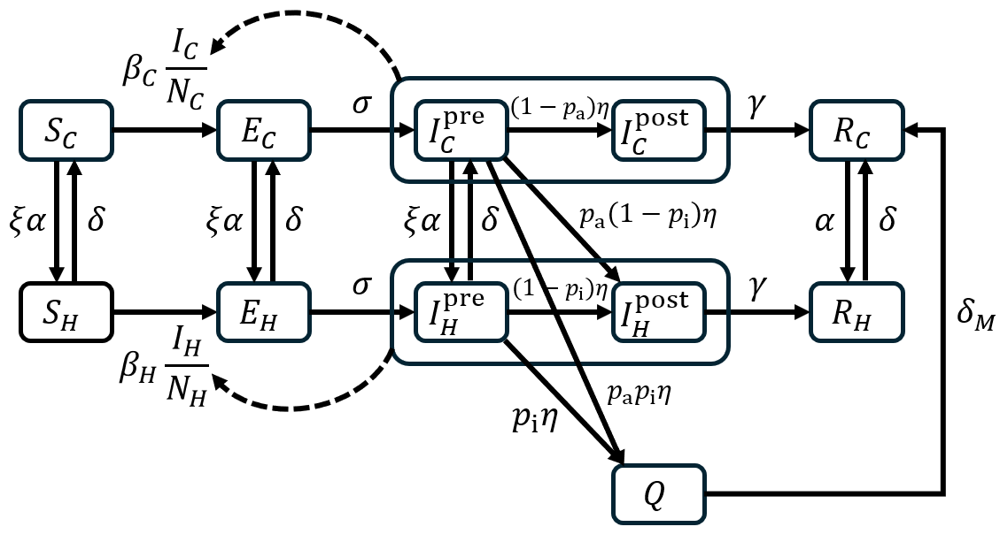

## Constant

Path to data:

```{r}
path2data <- paste0("C:/Users/ongph/github/data/dphil")
```

Files names:

```{r}
# Case notification
case_hcmc <- "measles_hcmc_24-25.rds"

# Census of HCMC
census_file <- "census2019_hcm.rds"

# CH1 outpatient
ch1_out_file <- "ch1_visit_day.rds"

# NCH Ha Noi
case_hn <- "measles_hn_final.rds"

# CH2 measles
case_ch2 <- "clinical_cases_ch2.rds"
```

## Packages

```{r, message=FALSE}
required <- c(
  "tidyverse",
  "fitdistrplus",
  "ggsci",
  "BayesianTools",
  "deSolve",
  "patchwork",
  "bayesplot",
  "posterior",
  "numDeriv"
)

to_install <- required[!required %in% installed.packages()[, "Package"]]
if (length(to_install))
  install.packages(to_install)

invisible(sapply(required, library, character.only = TRUE))

# MASS (via BayesianTools) masks dplyr::select; stats masks dplyr::filter
select <- dplyr::select
filter <- dplyr::filter

set.seed(20260914)
```

## Functions

```{r}
plot_interval <- function(data, var, trim = 0.99,
                          xlab = "days", ylab = "cases") {
  x <- dplyr::pull(data, {{ var }})
  x <- x[!is.na(x)]

  stats <- tibble(stat = c("mean", "median"),
                  value = c(mean(x), median(x)))

  ggplot(data, aes({{ var }})) +
    geom_histogram(binwidth = 1, boundary = -0.5,
                   fill = "grey80", colour = "white") +
    geom_vline(data = stats, aes(xintercept = value, colour = stat, linetype = stat),
               linewidth = 0.7) +
    scale_colour_manual(values = c(mean = "black", median = "grey40")) +
    scale_linetype_manual(values = c(mean = 1, median = 2)) +
    coord_cartesian(xlim = quantile(x, c(0, trim))) +
    labs(x = xlab, y = ylab, colour = NULL, linetype = NULL) +
    theme_classic() +
    theme(legend.position = "top")
}
```

```{r}
theme_thesis <- theme_classic(base_size = 11) +
  theme(strip.background = element_blank(),
        strip.text       = element_text(size = 11),
        legend.position  = "top")
```


## Data

Census:

```{r}
df_census <- file.path(path2data, census_file) |> 
  readRDS()
```

Case notification HCMC (for calibration):

```{r}
df_hcmc <- file.path(path2data, case_hcmc) |> 
  readRDS() |> 
  mutate(
    ngay_kp = as.Date(as.numeric(ngay_kp), origin = "1899-12-30"),
    onset_delay = ngay_nv - ngay_kp,
    inpatient = if_else(tinh_trang == "Điều trị ngoại trú", F, T)
  )
```

National Children's Hospital line list:

```{r}
df_hn <- file.path(path2data, case_hn) |>
  readRDS() |> 
  mutate(
    discharge_date = dmy(date.of.out.hospital),
    admission_date = dmy(admission_date),
    discharge_date = if_else(
      between(as.numeric(discharge_date - admission_date), -366, -300),
      discharge_date %m+% years(1),
      discharge_date,
      missing = discharge_date
    ),
    stay = discharge_date - admission_date,
    onset_delay = admission_date - onset_date
  )
```

Children's Hospital 2 in HCMC:

```{r}
df_ch2 <- file.path(path2data, case_ch2) |> 
  readRDS() |> 
  filter(
    year(admission) %in% c(2024, 2025)
  )
```

Children's Hospital 1 outpatient:

```{r}
df_ch1_out <- file.path(path2data, ch1_out_file) |> 
  readRDS()
```

## Model



```{r}
state_names <- c(
  "S_C", "E_C", "I_C_pre", "I_C_post", "R_C",
  "S_H", "E_H", "I_H_pre", "I_H_post", "Q", "R_H",
  "cum_onset_C", "cum_onset_H", "cum_noso", "cum_adm_rash", "cum_inf_C"
)

measles_ode <- function(t, y, p) {
  S_C <- y[["S_C"]]
  E_C <- y[["E_C"]]
  R_C <- y[["R_C"]]
  I_C_pre <- y[["I_C_pre"]]
  I_C_post <- y[["I_C_post"]]
  S_H <- y[["S_H"]]
  E_H <- y[["E_H"]]
  R_H <- y[["R_H"]]
  Q <- y[["Q"]]
  I_H_pre <- y[["I_H_pre"]]
  I_H_post <- y[["I_H_post"]]
  
  beta_C   <- p[["beta_C"]]
  beta_H  <- p[["beta_H"]]
  xi_alpha <- p[["xi_alpha"]]
  alpha   <- p[["alpha"]]
  p_a      <- p[["p_a"]]
  p_i     <- p[["p_i"]]
  sigma    <- p[["sigma"]]
  eta     <- p[["eta"]]
  gamma <- p[["gamma"]]
  delta    <- p[["delta"]]
  delta_M <- p[["delta_M"]]
  
  ## ---- forces of infection
  N_C     <- S_C + E_C + I_C_pre + I_C_post + R_C
  N_H_mix <- S_H + E_H + I_H_pre + I_H_post + R_H
  
  lambda_C <- beta_C * (I_C_pre + I_C_post) / N_C
  lambda_H <- if (N_H_mix > 0) beta_H * (I_H_pre + I_H_post) / N_H_mix else 0   # no hospital: no ward infections
  
  ## ---- community
  dS_C      <- -lambda_C * S_C - xi_alpha * S_C + delta * S_H
  
  dE_C      <-  lambda_C * S_C - sigma * E_C - xi_alpha * E_C + delta * E_H
  
  ## I_C_pre leaves by four routes: rash onset splits three ways, plus general
  ## admission. The three onset coefficients sum to eta.
  dI_C_pre  <-  sigma * E_C -
    (1 - p_a) * eta * I_C_pre -          # -> I_C_post
    p_a * (1 - p_i) * eta * I_C_pre -    # -> I_H_post
    p_a * p_i * eta * I_C_pre -          # -> Q
    xi_alpha * I_C_pre +                 # -> I_H_pre
    delta * I_H_pre                      # <- I_H_pre
  
  dI_C_post <-  (1 - p_a) * eta * I_C_pre -          # <- I_C_pre
    gamma * I_C_post
  
  dR_C      <-  gamma * I_C_post - alpha * R_C + delta * R_H + delta_M * Q
  
  ## ---- hospital
  dS_H      <-  xi_alpha * S_C - lambda_H * S_H - delta * S_H
  
  dE_H      <-  lambda_H * S_H + xi_alpha * E_C - sigma * E_H - delta * E_H
  
  ## I_H_pre leaves by three routes: rash onset splits two ways, plus discharge.
  ## The two onset coefficients sum to eta.
  dI_H_pre  <-  sigma * E_H +
    xi_alpha * I_C_pre -                 # <- I_C_pre
    (1 - p_i) * eta * I_H_pre -          # -> I_H_post
    p_i * eta * I_H_pre -                # -> Q
    delta * I_H_pre                      # -> I_C_pre
  
  dI_H_post <-  (1 - p_i) * eta * I_H_pre +          # <- I_H_pre
    p_a * (1 - p_i) * eta * I_C_pre -    # <- I_C_pre
    gamma * I_H_post
  
  dQ        <-  p_i * eta * I_H_pre +                # <- I_H_pre
    p_a * p_i * eta * I_C_pre -          # <- I_C_pre
    delta_M * Q
  
  dR_H      <-  gamma * I_H_post + alpha * R_C - delta * R_H
  
  ## ---- cumulative trackers -------------------------------------------------
  dcum_onset_C  <- eta * I_C_pre          # all community rash onsets
  dcum_onset_H  <- eta * I_H_pre          # admissions, rash appeared AFTER arrival
  dcum_noso     <- lambda_H * S_H         # infections acquired as an inpatient
  dcum_adm_rash <- p_a * eta * I_C_pre    # admissions, rash present on arrival
  dcum_inf_C    <- lambda_C * S_C         # infections acquired in the community
  
  ## names are documentation: deSolve reads this by position, so the order must
  ## match state_names. The check below enforces that.
  list(
    c(
      S_C = dS_C,
      E_C = dE_C,
      I_C_pre = dI_C_pre,
      I_C_post = dI_C_post,
      R_C = dR_C,
      S_H = dS_H,
      E_H = dE_H,
      I_H_pre = dI_H_pre,
      I_H_post = dI_H_post,
      Q = dQ,
      R_H = dR_H,
      cum_onset_C = dcum_onset_C,
      cum_onset_H = dcum_onset_H,
      cum_noso = dcum_noso,
      cum_adm_rash = dcum_adm_rash,
      cum_inf_C = dcum_inf_C
    )
  )
}
```

Helpers.

`p_i` is fixed rather than estimated: it only changes how long `I_H_post` transmits, which the case series barely sees. It is varied in a sensitivity analysis instead.

```{r}
p_i_fixed <- 0.9

init_state <- function(s_C0, s_H0, seed) {
  y <- c(
    S_C = s_C0 * N_C0 - seed, E_C = seed,
    I_C_pre = 0, I_C_post = 0, R_C = (1 - s_C0) * N_C0,
    S_H = s_H0 * N_H0, E_H = 0, I_H_pre = 0, I_H_post = 0, Q = 0,
    R_H = (1 - s_H0) * N_H0,
    cum_onset_C = 0, cum_onset_H = 0, cum_noso = 0,
    cum_adm_rash = 0, cum_inf_C = 0
  )
  y[state_names]
}

## quantities implied by the sampled parameters
##   xi     odds ratio of susceptibility between hospital and community. This is
##          the value that makes s_C0 and s_H0 a fixed point of the disease-free
##          system, so the simulation starts without a transient.
##   alpha  admission rate for immune children, set so the population-weighted
##          rate equals the observed general admission rate alpha_bar.
##   D_inf  mean time a community case spends infectious. Cases admitted at rash
##          onset skip I_C_post, so this depends on p_a.
derived <- function(par) {
  s_C0 <- par[["s_C0"]]
  s_H0 <- par[["s_H0"]]

  xi       <- (s_H0 * (1 - s_C0)) / (s_C0 * (1 - s_H0))
  alpha    <- alpha_bar / (1 + s_C0 * (xi - 1))
  xi_alpha <- xi * alpha

  D_inf  <- 1 / (eta + xi_alpha) +
            (eta / (eta + xi_alpha)) * (1 - par[["p_a"]]) / gamma
  beta_C <- par[["R_eff"]] / (D_inf * s_C0)

  list(xi = xi, alpha = alpha, xi_alpha = xi_alpha, D_inf = D_inf,
       beta_C = beta_C, beta_H = par[["kappa"]] * beta_C)
}

make_params <- function(par, d) {
  c(beta_C = d$beta_C, beta_H = d$beta_H,
    xi_alpha = d$xi_alpha, alpha = d$alpha,
    p_a = par[["p_a"]],
    p_i = if ("p_i" %in% names(par)) par[["p_i"]] else p_i_fixed,
    delta = delta, delta_M = delta_M,
    sigma = sigma, eta = eta, gamma = gamma)
}

solve_model <- function(par, times) {
  out <- tryCatch(
    ode(y = init_state(par[["s_C0"]], par[["s_H0"]], par[["seed"]]),
        times = times, func = measles_ode,
        parms = make_params(par, derived(par)),
        method = "lsoda", atol = 1e-3, rtol = 1e-6),
    error = function(e) NULL
  )
  if (is.null(out) || nrow(out) != length(times) || anyNA(out)) return(NULL)
  out
}

## weekly quantities. The two case types partition all rash onsets:
##   adm_w  = p_a * onset_C + onset_H   children admitted with measles
##   out_w  = (1 - p_a) * onset_C       community cases not admitted
run_model <- function(par, n_weeks, full = FALSE) {

  sol <- solve_model(par, seq.int(0L, n_weeks * 7L, by = 7L))
  if (is.null(sol)) return(NULL)

  onset_C  <- diff(sol[, "cum_onset_C"])
  onset_H  <- diff(sol[, "cum_onset_H"])
  adm_rash <- diff(sol[, "cum_adm_rash"])

  if (!full) {
    return(list(adm = adm_rash + onset_H,
                out = onset_C - adm_rash))
  }

  keep <- -1L   # drop t = 0, so each row pairs with one diff()

  tibble(
    week     = seq_len(n_weeks),
    onset_C  = onset_C,
    onset_H  = onset_H,
    adm      = adm_rash + onset_H,
    out      = onset_C - adm_rash,
    noso     = diff(sol[, "cum_noso"]),
    inf_C    = diff(sol[, "cum_inf_C"]),
    I_H_pre  = sol[keep, "I_H_pre"],
    I_H_post = sol[keep, "I_H_post"],
    Q        = sol[keep, "Q"],
    N_H      = rowSums(sol[keep, c("S_H", "E_H", "I_H_pre",
                                   "I_H_post", "Q", "R_H")])
  )
}
```

## Parameters

Disease natural history (rate per day):

```{r}
sigma <- 1 / 8      # exposed -> infectious
eta   <- 1 / 4      # pre-rash -> post-rash
gamma <- 1 / 4      # post-rash -> removed
```

### Hospital population and alpha_bar

Number of children 15 years and under in HCMC:

```{r}
N <- df_census |>
  filter(age <= 15) |>
  pull(n) |>
  sum()

cat("Total population N:", N)
```

Children's Hospital 1 reported 90,000 admissions per year. Assume HCMC total is
5 times CH1, of which 40% are HCMC residents. Mean length of stay 5.2 days.

`alpha_bar` is admissions per **community** child per day, because in the ODE
the admission flows multiply community compartments. Working from the admission
count avoids needing `N_C0` before `alpha_bar` is known, and makes the
disease-free state balance exactly.

```{r}
resident_frac <- 0.4
delta         <- 1 / 5.2

adm_per_day <- 5 * resident_frac * 90000 / 365
N_H0        <- adm_per_day / delta
N_C0        <- N - N_H0
alpha_bar   <- adm_per_day / N_C0

cat("admissions per day  :", round(adm_per_day), "\n")
cat("hospital N_H0       :", round(N_H0), "=",
    round(N_H0 / (N / 10000), 1), "per 10,000 children\n")
cat("community N_C0      :", round(N_C0), "\n")
cat("balance: admissions", round(alpha_bar * N_C0, 1),
    " discharges", round(delta * N_H0, 1), "per day\n")
```

For comparison, HCMC reports 42 beds per 10,000 population. Applying the same
40% residency adjustment gives 16.8 per 10,000.

### p_a and the instantaneous-admission assumption

The model admits a fraction `p_a` of community cases **at rash onset**, with no
delay. That is justified only if the observed onset-to-admission interval is
short. HCMC records a median of 0 days; the Hanoi line list is shown here for
comparison.

```{r}
d <- df_hn |>
  mutate(ad_delay = as.numeric(admission_date - onset_date)) |>
  filter(!is.na(ad_delay), ad_delay >= 0, ad_delay <= 10,
         source_province == "community", province == "Ha Noi")

d |> summarise(n = n(), mean = mean(ad_delay), median = median(ad_delay))

plot_interval(d, ad_delay, trim = 0.99,
              xlab = "onset to admission delay (days)", ylab = "cases")
```

### delta_M

Discharge rate from isolation, from measles length of stay at Children's
Hospital 2. Note this is the **total** measles stay, whereas `delta_M` governs
only the isolated portion, so it is an upper bound on the isolated stay.

```{r}
d <- df_ch2 |>
  mutate(stay = as.numeric(discharge - admission)) |>
  filter(!is.na(stay), stay >= 0, stay < 30)

est <- d |> summarise(n = n(), los_M = mean(stay), median = median(stay))
est

plot_interval(d, stay, xlab = "length of stay (days)", ylab = "cases")

delta_M <- 1 / est$los_M
cat("delta_M:", round(delta_M, 4), " mean isolated stay:",
    round(1 / delta_M, 1), "days\n")
```

### Structural check

Confirms the derivative vector comes back in the order `state_names` expects
and that the population is conserved. It has to run after the constants above,
because `derived` and `init_state` read them.

```{r}
local({
  par <- c(R_eff = 1.3, kappa = 0.5, p_a = 0.1,
           s_C0 = 0.08, s_H0 = 0.293, seed = 10)
  d   <- measles_ode(0, init_state(0.08, 0.293, 10),
                     make_params(par, derived(par)))[[1]]
  stopifnot(identical(names(d), state_names))
  stopifnot(abs(sum(d)) < 1e-6)
  cat("model check: state order and conservation OK\n")
})
```

## Disease-free equilibrium check

With transmission switched off, hospital occupancy and hospital susceptibility
must stay flat. Drift means the inputs are inconsistent and every fit inherits
an artificial transient.

```{r}
disease_free <- function(s_C0 = 0.08, s_H0 = 0.293, days = 365) {

  par <- c(R_eff = 1.3, kappa = 0, p_a = 0.1,
           s_C0 = s_C0, s_H0 = s_H0, seed = 0)

  p <- make_params(par, derived(par))
  p[["beta_C"]] <- 0          # no transmission
  p[["beta_H"]] <- 0

  ode(y = init_state(s_C0, s_H0, 0), times = 0:days,
      func = measles_ode, parms = p,
      method = "lsoda", atol = 1e-3, rtol = 1e-6) |>
    as.data.frame() |>
    as_tibble() |>
    transmute(
      day = time,
      N_H = S_H + E_H + I_H_pre + I_H_post + Q + R_H,
      s_H = S_H / (S_H + E_H + I_H_pre + I_H_post + R_H),
      s_C = S_C / (S_C + E_C + I_C_pre + I_C_post + R_C)
    )
}

df_check <- disease_free()

df_check |>
  summarise(N_H_drift_pct = 100 * (last(N_H) / first(N_H) - 1),
            s_H_drift_pct = 100 * (last(s_H) / first(s_H) - 1),
            s_C_drift_pct = 100 * (last(s_C) / first(s_C) - 1))

df_check |>
  ggplot(aes(day, N_H)) +
  geom_hline(yintercept = N_H0, linetype = "dashed") +
  geom_line(linewidth = 0.7) +
  labs(x = "Day", y = "Hospital population N_H",
       subtitle = "Dashed line is the specified N_H(0)") +
  theme_classic(base_size = 11)
```

## Calibration

Epidemic curve by inpatient and outpatient:

```{r}
df_week_wide <- df_hcmc |>
  filter(age <= 15) |>
  mutate(
    date = as_date(ngay_nv),
    week = floor_date(date, "week", week_start = 1),
    type = if_else(inpatient, "inpatient", "outpatient")
  ) |>
  filter(!is.na(week), !is.na(type)) |>
  count(week, type, name = "cases") |>
  complete(week = seq(min(week), max(week), by = "week"), type,
           fill = list(cases = 0)) |>
  pivot_wider(names_from = type, values_from = cases, values_fill = 0) |>
  mutate(total = inpatient + outpatient,
         prop_inpatient = inpatient / total) |>
  arrange(week)

n_lead_weeks <- 8      # simulated weeks before the first observed week

obs <- df_week_wide |>
  arrange(week) |>
  mutate(t_week = row_number() + n_lead_weeks)

n_weeks   <- max(obs$t_week)
obs_idx   <- obs$t_week
obs_total <- obs$total
t0_date   <- min(obs$week) - 7 * (n_lead_weeks + 1)

n_total <- as.integer(sum(obs$total))
n_in    <- as.integer(sum(obs$inpatient))

cat("weeks:", n_weeks, " total:", n_total, " inpatient:", n_in,
    " share:", round(n_in / n_total, 3), "\n")
```

### Likelihood

One reporting fraction `rho` applies to every case, admitted or not. Two terms:

- weekly total reported cases
- the inpatient share of all reported cases, as a binomial on the totals

Because the same `rho` scales both parts of the share, it cancels from `q`, so
`p_a` is pinned by the observed share and `rho` by the level of the weekly
series. Those are separate jobs, which keeps the two well identified.

One rho is also the right choice given that the September 2024 to March 2025
vaccination campaign is **not** in the model. A missing campaign inflates the
number of infections the model needs, and `rho` is a free multiplicative scale
that absorbs it. Because `q` is a ratio, `p_a` is protected: the campaign scales
numerator and denominator alike. With two reporting fractions and `rho_in`
fixed, the bias would land on `p_a` instead.

The cost of one rho is that admissions are taken to be as under-reported as
everything else, so `p_a` comes out near the observed inpatient share.

```{r}
par_names <- c("R_eff", "kappa", "p_a", "s_C0", "s_H0", "seed", "rho", "phi")

loglik <- function(x) {
  par <- setNames(as.numeric(x), par_names)

  sim <- run_model(par, n_weeks)
  if (is.null(sim)) return(-Inf)

  adm <- sim$adm[obs_idx]
  out <- sim$out[obs_idx]

  ## weekly total reported cases
  mu <- par[["rho"]] * (adm + out) + 0.5
  ll <- sum(dnbinom(obs_total, mu = mu, size = par[["phi"]], log = TRUE))

  ## inpatient share of reported cases. rho cancels here by construction.
  q <- sum(adm) / (sum(adm) + sum(out))
  q <- min(max(q, 1e-6), 1 - 1e-6)
  ll <- ll + dbinom(n_in, n_total, q, log = TRUE)

  if (is.finite(ll)) ll else -Inf
}
```

### Prior

```{r}
lower <- c(R_eff = 1.05, kappa = 0,  p_a = 0.005, s_C0 = 0.01,
           s_H0 = 0.05, seed = 1, rho = 0.001, phi = 0.1)

upper <- c(R_eff = 5,    kappa = 20, p_a = 0.90,  s_C0 = 0.40,
           s_H0 = 0.70, seed = 50, rho = 1, phi = 100)

n_C_eff <- 200    # effective n for s_C0: registry completeness, not registry size
n_H_eff <- 75     # effective n for s_H0: number of residual sera

log_prior <- function(x) {
  par <- setNames(as.numeric(x), par_names)

  dunif(par[["R_eff"]], 1.05, 5, log = TRUE) +
    dunif(par[["kappa"]], 0, 20, log = TRUE) +
    dbeta(par[["p_a"]], 2, 5, log = TRUE) +        # mean 0.29, deliberately wide
    dbeta(par[["s_C0"]], 0.080 * n_C_eff, 0.920 * n_C_eff, log = TRUE) +
    dbeta(par[["s_H0"]], 0.293 * n_H_eff, 0.707 * n_H_eff, log = TRUE) +
    dunif(par[["seed"]], 1, 50, log = TRUE) +
    dbeta(par[["rho"]], 2, 8, log = TRUE) +
    dunif(par[["phi"]], 0.1, 100, log = TRUE)
}

## draw from the prior, not from the bounding box, so the DEzs archive starts
## where the prior has weight
prior_sampler <- function(n = 1) {
  m <- cbind(runif(n, 1.05, 5), runif(n, 0, 20), rbeta(n, 2, 5),
             rbeta(n, 0.080 * n_C_eff, 0.920 * n_C_eff),
             rbeta(n, 0.293 * n_H_eff, 0.707 * n_H_eff),
             runif(n, 1, 50), rbeta(n, 2, 8), runif(n, 0.1, 100))
  if (n == 1) as.numeric(m) else m
}

prior <- createPrior(density = log_prior, sampler = prior_sampler,
                     lower = lower, upper = upper)
```

### Starting point

`R_eff` follows from the observed growth rate alone: substituting the
growth-rate solution for `beta_C` into `R_eff = beta_C * D_inf * s_C0` cancels
`s_C0`. Only a fraction `1 - p_a` of pre-rash cases reach `I_C_post`, which is
why that factor appears in the denominator. `p_a` starts at the observed
inpatient share, which is where a single `rho` puts it.

```{r}
# r_obs <- 0.0224      # refit over the actual growth phase
# 
# p_a_0   <- n_in / n_total
# D_0     <- 1 / eta + (1 - p_a_0) / gamma
# R_eff_0 <- (r_obs + sigma) * (r_obs + eta) * (r_obs + gamma) * D_0 /
#            (sigma * ((r_obs + gamma) + (1 - p_a_0) * eta))
# 
# p_start <- c(R_eff = R_eff_0, kappa = 0.5, p_a = p_a_0,
#              s_C0 = 0.080, s_H0 = 0.293, seed = 25, rho = 0.15, phi = 20)
# 
# cat("R_eff start", round(R_eff_0, 3), " p_a start", round(p_a_0, 3), "\n")
# 
# ## seed only shifts the curve in time, so scale it once on the early weeks
# sim <- run_model(p_start, n_weeks)
# mu0 <- p_start[["rho"]] * (sim$adm[obs_idx] + sim$out[obs_idx])
# p_start["seed"] <- min(p_start["seed"] * sum(obs_total[1:8]) / sum(mu0[1:8]), 49)
# 
# loglik(p_start)
# system.time(replicate(100, loglik(p_start)))   # seconds per 100 evaluations
```

### Quick fit by optimisation

Minutes rather than an hour. Use it to check the structure, try variants, and
give the sampler a sensible starting point. The objective is the log posterior,
so this is the posterior mode rather than the maximum likelihood: `s_C0` and
`s_H0` are prior-dominated and dropping their priors would leave them
unidentified.

Optimisation runs on an unconstrained scale, log for positive parameters and
logit for probabilities, so `optim` cannot step outside the feasible region.

Two Nelder-Mead passes and no BFGS. The restart matters because Nelder-Mead
collapses its simplex and stalls, and restarting from its own answer rebuilds
it. BFGS is omitted deliberately: `optim` computes its gradients by finite
differences with steps far below the solver noise from `atol = 1e-3`, so those
gradients are mostly numerical noise.

```{r}
# logit    <- function(p) log(p / (1 - p))
# invlogit <- function(x) 1 / (1 + exp(-x))
# 
# to_free <- function(par) {
#   c(log(par[["R_eff"]] - 1), log(par[["kappa"]]), logit(par[["p_a"]]),
#     logit(par[["s_C0"]]), logit(par[["s_H0"]]), log(par[["seed"]]),
#     logit(par[["rho"]]), log(par[["phi"]]))
# }
# 
# from_free <- function(x) {
#   c(R_eff = 1 + exp(x[[1]]), kappa = exp(x[[2]]), p_a = invlogit(x[[3]]),
#     s_C0 = invlogit(x[[4]]), s_H0 = invlogit(x[[5]]), seed = exp(x[[6]]),
#     rho = invlogit(x[[7]]), phi = exp(x[[8]]))
# }
# 
# neg_logpost <- function(x) {
#   if (any(!is.finite(x)) || any(abs(x) > 30)) return(1e10)
#   par <- from_free(x)
#   if (any(par < lower) || any(par > upper)) return(1e10)
#   v <- loglik(par) + log_prior(par)
#   if (is.finite(v)) -v else 1e10
# }
# 
# fit_map <- function(start) {
#   o <- optim(to_free(start), neg_logpost, method = "Nelder-Mead",
#              control = list(maxit = 3000, reltol = 1e-8))
#   o <- optim(o$par, neg_logpost, method = "Nelder-Mead",
#              control = list(maxit = 3000, reltol = 1e-8))
#   list(value = o$value, par = from_free(o$par), x = o$par, code = o$convergence)
# }
# 
# system.time(map <- fit_map(p_start))
# cat("convergence:", map$code, " (0 = converged, 1 = hit maxit)\n")
# cat("neg log posterior:", round(map$value, 2), "\n")
# round(map$par, 4)
```

Six restarts from scattered points, run in parallel. All should land within
about 0.1 of the same `nlp`; a spread means the surface is multimodal and the
single mode is not trustworthy.

```{r}
# cl <- parallel::makeCluster(min(6, parallel::detectCores() - 1))
# parallel::clusterEvalQ(cl, library(deSolve))
# parallel::clusterExport(cl, varlist = ls(globalenv()), envir = globalenv())
# 
# multi <- parallel::parLapply(cl, 1:6, function(i) {
#   s <- pmin(pmax(p_start * runif(length(p_start), 0.6, 1.6),
#                  lower + 1e-6), upper - 1e-6)
#   o <- fit_map(s)
#   c(nlp = o$value, o$par)
# }) |>
#   bind_rows() |>
#   arrange(nlp)
# 
# parallel::stopCluster(cl)
# 
# print(multi, n = Inf, width = Inf)
```

For comparison, the log posterior of a flat model that ignores the epidemic
entirely. The fit should beat it by hundreds of log units.

```{r}
# -sum(dnbinom(obs_total, mu = mean(obs_total), size = 2, log = TRUE))
```

Start the sampler from the mode rather than from the hand-derived guess.

```{r}
# p_start <- map$par
# loglik(p_start)
```

### Fit

Three independent DEzs runs, each with six internal chains. The package
documentation warns that Gelman diagnostics applied to the internal chains of a
single population sampler can be optimistic, because those chains are only
argued to be independent after burn-in. `nrChains` controls independent runs and
is separate from the internal chain count.

```{r}
# n_runs   <- 3
# n_chains <- 6
# n_par    <- min(n_chains, parallel::detectCores() - 1)
# 
# ## Each run needs its own starting matrix, otherwise all three begin in the same
# ## place and the diagnostic means nothing. startValue must be a LIST.
# make_start <- function() {
#   t(replicate(n_chains, pmin(
#     pmax(p_start[par_names] *
#            runif(length(par_names), 0.7, 1.4), lower + 1e-6), upper
#   )))
# }
# 
# start_list <- replicate(n_runs, make_start(), simplify = FALSE)
# 
# start_ll <- sapply(start_list, function(s)
#   apply(s, 1, loglik))
# stopifnot(all(is.finite(start_ll)))
# round(start_ll, 1)
# 
# setup <- createBayesianSetup(
#   likelihood = loglik,
#   prior      = prior,
#   names      = par_names,
#   parallel   = n_par,
#   parallelOptions = list(
#     variables = "all",
#     packages  = c("deSolve", "stats", "tibble"),
#     dlls      = NULL
#   )
# )
# 
# setup$likelihood$density(start_list[[1]])   # confirm the workers can evaluate
# 
# ## iterations and burnin are PER RUN, so total work is n_runs times this
# t_fit <- system.time(fit <- runMCMC(
#   setup,
#   "DEzs",
#   settings = list(
#     iterations = 1.5e5,
#     burnin     = 5e4,
#     startValue = start_list,
#     nrChains   = n_runs,
#     message    = TRUE
#   )
# ))
# t_fit
# 
# stopParallel(setup)
# saveRDS(fit, "measles_fit.rds")
```

### Diagnostics

```{r}
fit <- readRDS("measles_fit.rds")

gelmanDiagnostics(fit, plot = FALSE)
summary(fit)
# correlationPlot(fit)

draws <- getSample(fit, coda = TRUE) |>
  posterior::as_draws_df()

## quantile2 returns q2.5 and q97.5. "q5" is not a summary function name, which
## is why passing it as a string fails.
posterior::summarise_draws(
  draws,
  "median",
  ~ posterior::quantile2(.x, probs = c(0.025, 0.975)),
  "rhat", "ess_bulk", "ess_tail"
) |>
  print(n = Inf)
# targets: rhat < 1.01, ess_bulk and ess_tail above 400 per parameter

bayesplot::mcmc_rank_overlay(draws)

posterior::summarise_draws(
  draws,
  "median",
  mcse_med = posterior::mcse_median,
  ~ posterior::mcse_quantile(.x, probs = c(0.025, 0.975))
)
```

## Posterior

```{r}
post <- getSample(fit, thin = 20) |>
  as.data.frame() |>
  setNames(par_names) |>
  as_tibble() |>
  mutate(
    xi       = s_H0 * (1 - s_C0) / (s_C0 * (1 - s_H0)),
    alpha    = alpha_bar / (1 + s_C0 * (xi - 1)),
    xi_alpha = xi * alpha,
    D_inf    = 1 / (eta + xi_alpha) +
               (eta / (eta + xi_alpha)) * (1 - p_a) / gamma,
    beta_C   = R_eff / (D_inf * s_C0),
    beta_H   = kappa * beta_C,
    R0       = beta_C * D_inf,
    per_case_ratio = kappa * s_H0 / s_C0   # infections per case, H relative to C
  )

post |>
  summarise(across(
    c(R_eff, beta_C, beta_H, R0, kappa, p_a, per_case_ratio,
      s_C0, s_H0, rho, xi, seed, phi),
    list(med = ~ median(.x),
         lo  = ~ quantile(.x, 0.025),
         hi  = ~ quantile(.x, 0.975))
  )) |>
  pivot_longer(everything()) |>
  separate(name, c("par", "stat"), sep = "_(?=[^_]+$)") |>
  pivot_wider(names_from = stat, values_from = value) |>
  mutate(crI = paste0(sprintf("%.2f", lo), "-", sprintf("%.2f", hi))) |> 
  # write.csv("post.csv", quote = F, row.names = F)
  print(n = Inf)
```

### Prediction vs observation

```{r}
set.seed(20260921)
wk2date <- function(w) t0_date + 7 * w

pp <- post |>
  slice_sample(n = 500) |>
  mutate(draw = row_number()) |>
  group_split(draw) |>
  map_dfr(function(d) {
    par <- setNames(as.numeric(d[par_names]), par_names)
    s <- run_model(par, n_weeks, full = TRUE)
    if (is.null(s)) return(NULL)
    tibble(draw  = d$draw,
           week  = s$week,
           a_w   = s$adm,
           o_w   = s$out,
           mu    = d$rho * (s$adm + s$out),
           share = s$adm / (s$adm + s$out),
           noso  = s$noso) |>
      mutate(y_rep = rnbinom(n(), mu = mu + 0.5, size = d$phi))
  })

band <- pp |>
  group_by(week) |>
  summarise(med  = median(mu),
            lo95 = quantile(y_rep, 0.025), hi95 = quantile(y_rep, 0.975),
            lo50 = quantile(y_rep, 0.25),  hi50 = quantile(y_rep, 0.75),
            .groups = "drop") |>
  mutate(date = wk2date(week))

obs_d <- obs |> mutate(date = wk2date(t_week))
```

### Plot calibration

```{r}
## plotmath labels: kappa prints as a Greek letter, s_C0 as s with a subscript
lbl <- c(R_eff = "R[eff]", kappa = "kappa", p_a = "p[a]", s_C0 = "s[C0]",
         s_H0 = "s[H0]", seed = "E[0]", rho = "rho", phi = "phi")
 
save_fig <- function(p, file, width = 16, height) {
  ggsave(file.path("figs/chap3", file), p, width = width, height = height,
         units = "cm", dpi = 300, bg = "white")
}
 
## the campaign is not in the model; shading it shows where the model may depart
## from the data. Replace the two dates with the range of df_cp.
campaign <- tibble(start = as.Date("2024-09-01"), end = as.Date("2025-03-31"))
 
campaign_layer <- geom_rect(
  data = campaign, aes(xmin = start, xmax = end, ymin = -Inf, ymax = Inf),
  inherit.aes = FALSE, fill = "grey94")
 
date_axis <- list(
  scale_x_date(date_breaks = "3 months", date_labels = "%b\n%Y"),
  coord_cartesian(xlim = range(obs_d$date))
)
 
 
# =============================================================================
# Fit
# =============================================================================
 
fig_fit <- ggplot(band, aes(date)) +
  campaign_layer +
  annotate("text", x = campaign$start, y = Inf, label = "Vaccination campaign",
           hjust = -0.05, vjust = 1.6, size = 3, colour = "grey35") +
  geom_ribbon(aes(ymin = lo95, ymax = hi95), fill = "grey82") +
  geom_ribbon(aes(ymin = lo50, ymax = hi50), fill = "grey62") +
  geom_line(aes(y = med), linewidth = 0.6) +
  geom_point(data = obs_d, aes(date, total),
             shape = 21, fill = "white", size = 1.5, stroke = 0.5) +
  date_axis +
  scale_y_continuous(expand = expansion(mult = c(0, 0.15))) +   # room for the label
  labs(x = NULL, y = "Weekly reported\ncases") +
  theme_thesis
 
 
# =============================================================================
# Residuals
#
# Pearson residuals under the negative binomial, at the posterior median of phi.
# Runs of same-signed residuals mean structure the model does not capture.
# =============================================================================
 
phi_med <- median(post$phi)
 
resid_df <- obs_d |>
  left_join(band |> select(week, med), by = c("t_week" = "week")) |>
  mutate(resid = (total - med) / sqrt(med + med^2 / phi_med))
 
fig_resid <- ggplot(resid_df, aes(date, resid)) +
  campaign_layer +
  geom_hline(yintercept = 0, linewidth = 0.4) +
  geom_hline(yintercept = c(-2, 2), linetype = "dotted", linewidth = 0.4) +
  geom_point(shape = 21, fill = "white", size = 1.3, stroke = 0.5) +
  date_axis +
  scale_y_continuous(breaks = c(-2, 0, 2)) +
  labs(x = NULL, y = "Residual") +
  theme_thesis
 
 
# =============================================================================
# Posterior distributions and correlations
#
# Diagonal: posterior and prior densities, both scaled by the posterior's peak,
# so a prior that the data overrode reads as flat. Lower triangle: 2,000 joint
# draws. Upper triangle: posterior correlation.
# =============================================================================
 
post_p  <- post |> select(all_of(par_names))
prior_p <- prior_sampler(20000) |> as.data.frame() |> setNames(par_names)
 
## axis range per parameter: central 99.8% of the posterior
lo  <- map_dbl(post_p, ~ quantile(.x, 0.001))
hi  <- map_dbl(post_p, ~ quantile(.x, 0.999))
mid <- (lo + hi) / 2
 
cells <- expand_grid(xvar = par_names, yvar = par_names) |>
  mutate(i = match(yvar, par_names), j = match(xvar, par_names))
 
as_panel <- function(d) {
  d |> mutate(xvar = factor(xvar, levels = par_names),
              yvar = factor(yvar, levels = par_names))
}
 
thin <- post_p |> slice_sample(n = 2000)
 
pts <- cells |>
  filter(i > j) |>
  mutate(xy = map2(xvar, yvar, ~ tibble(x = thin[[.x]], y = thin[[.y]]))) |>
  unnest(xy) |>
  as_panel()
 
dens <- map_dfr(par_names, function(p) {
  d_post <- density(post_p[[p]],  from = lo[[p]], to = hi[[p]], n = 200)
  d_pri  <- density(prior_p[[p]], from = lo[[p]], to = hi[[p]], n = 200)
  k <- 0.95 * (hi[[p]] - lo[[p]]) / max(d_post$y)
  bind_rows(tibble(dist = "Posterior", x = d_post$x, y = lo[[p]] + k * d_post$y),
            tibble(dist = "Prior",     x = d_pri$x,  y = lo[[p]] + k * d_pri$y)) |>
    mutate(xvar = p, yvar = p)
}) |>
  as_panel()
 
cors <- cells |>
  filter(i < j) |>
  mutate(r = map2_dbl(xvar, yvar, ~ cor(post_p[[.x]], post_p[[.y]])),
         x = mid[xvar], y = mid[yvar]) |>
  as_panel()
 
## tick marks away from the panel edges, so labels of neighbouring panels
## cannot collide
inner_breaks <- function(l) {
  b <- pretty(l, n = 3)
  b[b > l[1] + 0.12 * diff(l) & b < l[2] - 0.12 * diff(l)]
}
 
## hold every row and column to its parameter's range
limits <- bind_rows(
  cells |> transmute(xvar, yvar, x = lo[xvar], y = lo[yvar]),
  cells |> transmute(xvar, yvar, x = hi[xvar], y = hi[yvar])
) |>
  as_panel()
 
fig_corner <- ggplot() +
  geom_blank(data = limits, aes(x, y)) +
  geom_rect(data = cors, aes(xmin = -Inf, xmax = Inf, ymin = -Inf, ymax = Inf,
                             fill = r)) +
  geom_text(data = cors, aes(x, y, label = sprintf("%.2f", r),
                             colour = abs(r) > 0.6), size = 2.6) +
  geom_point(data = pts, aes(x, y), size = 0.2, alpha = 0.25) +
  geom_line(data = dens, aes(x, y, linetype = dist), linewidth = 0.4) +
  facet_grid(yvar ~ xvar, scales = "free", switch = "both",
             labeller = as_labeller(lbl, default = label_parsed)) +
  scale_fill_gradient2(low = "#2166AC", mid = "white", high = "#B2182B",
                       limits = c(-1, 1), guide = "none") +
  scale_colour_manual(values = c(`FALSE` = "black", `TRUE` = "white"),
                      guide = "none") +
  scale_linetype_manual(values = c(Posterior = "solid", Prior = "dashed"),
                        name = NULL) +
  scale_x_continuous(breaks = inner_breaks,
                     guide = guide_axis(check.overlap = TRUE)) +
  scale_y_continuous(breaks = inner_breaks,
                     guide = guide_axis(check.overlap = TRUE)) +
  labs(x = NULL, y = NULL) +
  theme_thesis +
  theme(strip.placement = "outside",
        panel.border    = element_rect(colour = "grey75", fill = NA),
        axis.line       = element_blank(),
        axis.text       = element_text(size = 6),
        panel.spacing   = unit(1.2, "mm"))
 
 
# =============================================================================
# Rank plots, one line per independent run, with R-hat and ESS
#
# Each run's six internal chains are pooled, so the plot compares the three
# independent runs. Draws come from each run separately, so the grouping does
# not depend on how getSample() orders chains in the combined object.
# =============================================================================
 
by_run <- map_dfr(seq_along(fit), function(i) {
  getSample(fit[[i]]) |>
    as.data.frame() |>
    setNames(par_names) |>
    mutate(run = factor(i))
})
 
stopifnot(nrow(by_run) == nrow(getSample(fit)))   # same draws as elsewhere
 
n_bins     <- 20
rank_break <- seq(0, nrow(by_run), length.out = n_bins + 1)   # equal-count bins
expected   <- nrow(by_run) / nlevels(by_run$run) / n_bins     # per bin if uniform
 
rank_df <- by_run |>
  pivot_longer(-run, names_to = "parameter") |>
  mutate(parameter = factor(parameter, levels = par_names)) |>
  group_by(parameter) |>
  mutate(rank = rank(value)) |>
  ungroup()
 
## rank-normalised R-hat and the smaller of bulk and tail ESS, per parameter
conv <- posterior::summarise_draws(draws, "rhat", "ess_bulk", "ess_tail") |>
  filter(variable %in% par_names) |>
  transmute(parameter = factor(variable, levels = par_names),
            x = nrow(by_run) / 2,
            label = sprintf("R-hat %.2f\nESS %s", rhat,
                            format(round(pmin(ess_bulk, ess_tail)),
                                   big.mark = ",")))
 
fig_rank <- ggplot(rank_df, aes(rank, colour = run)) +
  geom_hline(yintercept = expected, linetype = "dashed", colour = "grey50") +
  stat_bin(geom = "line", breaks = rank_break, pad = FALSE,
           position = "identity", linewidth = 0.5) +
  geom_text(data = conv, aes(x, 0, label = label), inherit.aes = FALSE,
            vjust = -0.4, size = 2.5, colour = "grey30") +
  facet_wrap(~ parameter, ncol = 4,
             labeller = as_labeller(lbl, default = label_parsed)) +
  ggsci::scale_colour_nejm(guide = "none") +   # lines are runs; see caption
  scale_x_continuous(breaks = NULL) +
  scale_y_continuous(limits = c(0, NA), n.breaks = 3) +
  labs(x = "Rank of draw, pooled across runs", y = "Draws per bin") +
  theme_thesis +
  theme(axis.text.y = element_text(size = 7))
 
 
# =============================================================================
# One figure
# =============================================================================
 
fig_all <-
  (fig_fit + theme(axis.text.x = element_blank(),
                   axis.ticks.x = element_blank())) /
  fig_resid /
  fig_corner /
  fig_rank +
  plot_layout(heights = c(5, 2, 10.5, 4.5)) +
  plot_annotation(tag_levels = "A") &
  theme(plot.tag = element_text(face = "bold", size = 12))

fig_all

# save_fig(fig_all, "fig_calibration.png", height = 26)
```

### Values calibration

```{r}
fmt <- function(x, d = 2) formatC(x, format = "f", digits = d, big.mark = ",")
ci  <- function(x, d = 2) sprintf("%s (%s to %s)", fmt(median(x), d),
                                  fmt(quantile(x, 0.025), d),
                                  fmt(quantile(x, 0.975), d))

## 1. weekly counts inside the 95% posterior predictive interval
cov <- obs |>
  left_join(band |> select(week, lo95, hi95), by = c("t_week" = "week")) |>
  summarise(n_in_band = sum(total >= lo95 & total <= hi95),
            n_weeks   = n(),
            pct       = 100 * n_in_band / n_weeks)

## 2. fitted totals per draw, over observed weeks only (lead weeks excluded)
tot <- pp |>
  filter(week %in% obs_idx) |>
  group_by(draw) |>
  summarise(rep_total = sum(mu),
            share     = sum(a_w) / sum(a_w + o_w),
            .groups   = "drop")

## 3. parameter estimates and contraction relative to the prior
prior_draws <- prior_sampler(20000) |>
  as.data.frame() |>
  setNames(par_names) |>
  as_tibble()

par_tab <- tibble(parameter = par_names) |>
  mutate(estimate    = map_chr(parameter, ~ ci(post[[.x]], 3)),
         contraction = map_dbl(parameter,
                               ~ 1 - var(post[[.x]]) / var(prior_draws[[.x]])))

cov
tot |> summarise(rep_total = ci(rep_total, 0), share = ci(share, 3))
print(par_tab, n = Inf)

## the paragraph, filled in
contr <- setNames(par_tab$contraction, par_tab$parameter)

cat(sprintf(paste0(
  "%d of %d weekly counts (%.0f%%) fell inside the 95%% posterior predictive ",
  "interval. The model gave %s reported cases against %s observed, and an ",
  "inpatient share of %s against %s observed; both were fitted. R_eff was %s ",
  "(95%% CrI), p_a %s and rho %s. Posterior contraction was %.2f for s_C0 and ",
  "%.2f for s_H0, so both stayed close to their priors. kappa was %s, ",
  "conditional on p_i = %s.\n"),
  cov$n_in_band, cov$n_weeks, cov$pct,
  ci(tot$rep_total, 0), fmt(n_total, 0),
  ci(tot$share, 3), fmt(n_in / n_total, 3),
  ci(post$R_eff, 2), ci(post$p_a, 2), ci(post$rho, 2),
  contr[["s_C0"]], contr[["s_H0"]],
  ci(post$kappa, 2), p_i_fixed))
```


Coverage of the 95% predictive interval. With 80 observations it should be near
0.95; much less means the model is overconfident, much more means `phi` has
grown to absorb misfit.

```{r}
obs_d |>
  left_join(band |> select(week, lo95, hi95), by = c("t_week" = "week")) |>
  summarise(coverage_95 = mean(total >= lo95 & total <= hi95))
```

The modelled inpatient share is constant in time; the observed share drifts.
Only its overall level entered the likelihood, so the weekly pattern is a check.

```{r}
pp |>
  group_by(week) |>
  summarise(mod = median(share), .groups = "drop") |>
  mutate(date = wk2date(week)) |>
  ggplot(aes(date, mod)) +
  geom_line(linewidth = 0.6) +
  geom_point(data = obs_d, aes(date, prop_inpatient), size = 1, alpha = 0.5) +
  scale_x_date(date_breaks = "3 months", date_labels = "%b %Y") +
  labs(x = NULL, y = "Inpatient share of reported cases") +
  theme_classic(base_size = 11)
```

### Unfitted quantities

```{r}
post |>
  slice_sample(n = 200) |>
  mutate(draw = row_number()) |>
  group_split(draw) |>
  map_dfr(function(d) {
    par <- setNames(as.numeric(d[par_names]), par_names)
    s <- run_model(par, n_weeks, full = TRUE)
    if (is.null(s)) return(NULL)
    tibble(infections = sum(s$inf_C) + sum(s$noso),
           nosocomial = sum(s$noso),
           adm_total  = sum(s$adm),
           prop_pre   = sum(s$onset_H) / sum(s$adm),
           pk_I_H_pre = max(s$I_H_pre),
           attack     = (sum(s$inf_C) + sum(s$noso)) / (d$s_C0 * N_C0))
  }) |>
  mutate(prop_noso = nosocomial / infections) |>
  summarise(across(c(infections, attack, nosocomial, prop_noso,
                     adm_total, prop_pre, pk_I_H_pre),
                   list(med = ~ median(.x),
                        lo  = ~ quantile(.x, 0.025),
                        hi  = ~ quantile(.x, 0.975))))
# prop_pre is NOT fitted: compare against 530 / 3743 = 0.142 in the linelist
# adm_total is the modelled number of admissions, not the reported number:
#   reported admissions = rho * adm_total, which should recover n_in
```

### Campaign not modelled

The September 2024 to March 2025 vaccination campaign is not in the model, so
`rho` absorbs it. The direction is known: total infections are overestimated and
`rho` underestimated, by somewhere between about 4% and 25% depending on how
well the campaign reached susceptible children.

`rho` is constant in time, so it cannot represent a removal of susceptibles
localised to one part of the outbreak. Expect the model to sit above the data
after the campaign bites, because it has to end the epidemic by depletion alone.
The residual plot below is the check; a run of positive residuals after the
dashed line is the campaign showing as structural misfit.

```{r}
obs_d |>
  left_join(band |> dplyr::select(week, med), by = c("t_week" = "week")) |>
  mutate(resid = (total - med) / sqrt(med + med^2 / median(post$phi))) |>
  ggplot(aes(date, resid)) +
  geom_hline(yintercept = 0) +
  geom_hline(yintercept = c(-2, 2), linetype = "dotted") +
  geom_vline(xintercept = as.Date("2024-09-01"), linetype = "dashed") +
  geom_point(size = 1) +
  labs(x = NULL, y = "Standardised residual",
       subtitle = "Dashed line: campaign start") +
  theme_classic(base_size = 11)
```

## Force of infection

```{r}
set.seed(20260922)
n_draws <- 1000       # 200 is enough while adjusting the layout

obs_d <- obs |> mutate(date = t0_date + 7 * t_week)

theme_thesis <- theme_classic(base_size = 11) +
  theme(strip.background = element_blank(),
        legend.title     = element_blank())

narrow <- theme(axis.text = element_text(size = 8))   # three panels in a row

date_axis <- list(
  scale_x_date(date_breaks = "6 months", date_labels = "%b\n%Y"),
  coord_cartesian(xlim = range(obs$week))
)

setting_col <- c(Community = "#BC3C29", Hospital = "#0072B5")
kappa_col   <- "#E18727"

x_right <- max(obs$week)   # labels end here, inside the visible range

## ---- simulate each posterior draw -------------------------------------------
par_of <- function(d) {
  c(setNames(as.numeric(d[par_names]), par_names), p_i = p_i_fixed)
}

trajectory <- function(par, days = n_weeks * 7) {
  sol <- solve_model(par, 0:days)
  if (is.null(sol)) return(NULL)
  d <- derived(par)
  as.data.frame(sol) |>
    as_tibble() |>
    transmute(
      date     = t0_date + time,
      prev_C   = (I_C_pre + I_C_post) / (S_C + E_C + I_C_pre + I_C_post + R_C),
      prev_H   = (I_H_pre + I_H_post) / (S_H + E_H + I_H_pre + I_H_post + R_H),
      s_C      = S_C / (S_C + E_C + I_C_pre + I_C_post + R_C),
      s_H      = S_H / (S_H + E_H + I_H_pre + I_H_post + R_H),
      lambda_C = d$beta_C * prev_C,
      lambda_H = d$beta_H * prev_H
    )
}

traj <- post |>
  slice_sample(n = n_draws) |>
  mutate(draw = row_number()) |>
  group_split(draw) |>
  map_dfr(function(d) {
    s <- trajectory(par_of(d))
    if (is.null(s)) return(NULL)
    s |> mutate(draw = d$draw, kappa = d$kappa)
  })

## dates on which the outbreak is under way (median community prevalence above
## 1 in 100,000); ratios of near-zero prevalences are not meaningful
window <- traj |>
  group_by(date) |>
  summarise(p = median(prev_C), .groups = "drop") |>
  filter(p > 1e-5) |>
  pull(date)

## each draw at its own peak of community prevalence
peaks <- traj |>
  group_by(draw) |>
  slice_max(prev_C, n = 1, with_ties = FALSE) |>
  ungroup()

peak_date <- median(peaks$date)

## ---- A: the result ------------------------------------------------------------
ratio_t <- traj |>
  filter(date %in% window) |>
  mutate(foi_ratio = lambda_H / lambda_C) |>        # = kappa x prevalence ratio
  group_by(date) |>
  summarise(med = median(foi_ratio),
            lo  = quantile(foi_ratio, 0.025),
            hi  = quantile(foi_ratio, 0.975), .groups = "drop")

kq <- quantile(peaks$kappa, c(0.025, 0.5, 0.975))

end_y <- ratio_t |> filter(date <= x_right) |> slice_max(date, n = 1) |> pull(med)

pA <- ggplot(ratio_t, aes(date, med)) +
  geom_hline(yintercept = 1, linetype = "dashed", colour = "grey50") +
  geom_vline(xintercept = peak_date, linetype = "dotted") +
  annotate("rect", xmin = min(window), xmax = max(window),
           ymin = kq[[1]], ymax = kq[[3]], fill = kappa_col, alpha = 0.25) +
  annotate("segment", x = min(window), xend = max(window),
           y = kq[[2]], yend = kq[[2]], colour = kappa_col, linewidth = 0.6) +
  geom_ribbon(aes(ymin = lo, ymax = hi), fill = "grey40", alpha = 0.25) +
  geom_line(linewidth = 0.6) +
  annotate("text", x = x_right, y = end_y, label = "Force of infection",
           hjust = 1, vjust = -0.8, size = 2.8) +
  annotate("text", x = x_right, y = kq[[2]],
           label = "Contact rate\nratio (\u03ba)", colour = kappa_col,
           hjust = 1, vjust = 1.3, size = 2.8, lineheight = 0.9) +
  scale_y_log10(labels = scales::label_number(drop0trailing = TRUE)) +
  date_axis +
  labs(x = NULL, y = "Hospital / community") +
  theme_thesis +
  narrow

## ---- B and C: the two settings side by side ---------------------------------
long <- traj |>
  filter(date %in% window) |>
  transmute(draw, date,
            foi_Community  = 1000 * lambda_C, foi_Hospital  = 1000 * lambda_H,
            prev_Community = 1000 * prev_C,   prev_Hospital = 1000 * prev_H) |>
  pivot_longer(-c(draw, date), names_to = c("quantity", "setting"),
               names_sep = "_") |>
  group_by(quantity, setting, date) |>
  summarise(med = median(value),
            lo  = quantile(value, 0.025),
            hi  = quantile(value, 0.975), .groups = "drop")

## one shared legend for B and C (collected in the assembly below)
time_panel <- function(q, ylab) {
  long |>
    filter(quantity == q) |>
    ggplot(aes(date, med, colour = setting, fill = setting)) +
    geom_vline(xintercept = peak_date, linetype = "dotted") +
    geom_ribbon(aes(ymin = lo, ymax = hi), alpha = 0.25, colour = NA) +
    geom_line(linewidth = 0.6) +
    scale_colour_manual(values = setting_col) +
    scale_fill_manual(values = setting_col) +
    scale_y_log10(labels = scales::label_number(drop0trailing = TRUE)) +
    date_axis +
    labs(x = NULL, y = ylab) +
    theme_thesis +
    narrow
}

pB <- time_panel("foi",  "Force of infection\n(per 1,000 per day)")
pC <- time_panel("prev", "Prevalence\nper 1,000")

## ---- D: how the pieces combine, at the peak ---------------------------------
## each component gets a letter, and each product shows which letters multiply.
## The products follow the argument: kappa x P is the risk to a susceptible
## child; multiplying by S gives the risk to any child in the setting.
labels_D <- c(
  kappa = "Contact rate ratio, \u03ba",
  prev  = "Infectious prevalence, P",
  sus   = "Susceptible proportion, S",
  foi   = "Force of infection, \u03ba \u00d7 P",
  inc   = "Incidence, \u03ba \u00d7 P \u00d7 S",
  out   = "Infections per infectious child, \u03ba \u00d7 S"
)

decomp <- peaks |>
  transmute(kappa,
            prev = prev_H / prev_C,
            sus  = s_H / s_C,
            foi  = kappa * prev,
            inc  = kappa * prev * sus,
            out  = kappa * sus) |>
  pivot_longer(everything(), names_to = "factor") |>
  group_by(factor) |>
  summarise(med   = median(value),
            lo    = quantile(value, 0.025),
            hi    = quantile(value, 0.975),
            p_gt1 = mean(value > 1), .groups = "drop") |>
  mutate(type   = if_else(factor %in% c("kappa", "prev", "sus"),
                          "Components", "Products"),
         colour = if_else(factor == "kappa", kappa_col, "black"),
         label  = factor(labels_D[factor], levels = rev(labels_D)))

pD <- ggplot(decomp, aes(med, label, colour = colour)) +
  geom_vline(xintercept = 1, linetype = "dashed", colour = "grey50") +
  geom_pointrange(aes(xmin = lo, xmax = hi, shape = type), fill = "white") +
  scale_colour_identity() +
  scale_shape_manual(values = c(Components = 16, Products = 23), guide = "none") +
  scale_x_log10(labels = scales::label_number(drop0trailing = TRUE)) +
  facet_grid(type ~ ., scales = "free_y", space = "free_y") +
  labs(x = "Hospital / community, at the peak", y = NULL) +
  theme_thesis +
  theme(strip.text.y = element_text(angle = 0))

## ---- assemble -----------------------------------------------------------------
## B and C share one legend, placed in its own area above them (G) so it does
## not sit over A. free() stops the long labels in D from widening the left
## margin of A. Plots fill the design areas in alphabetical order: A, B, C, D, G.
design <- "
#GG
ABC
DDD
"

fig1 <- pA + pB + pC + free(pD) + guide_area() +
  plot_layout(design = design, guides = "collect",
              heights = c(0.12, 1, 1.2)) +
  plot_annotation(tag_levels = "A") &
  theme(legend.position  = "top",
        legend.direction = "horizontal",
        plot.tag = element_text(face = "bold", size = 12))

fig1

# ggsave("figs/chap3/fig_insight_1.png", fig1, width = 16, height = 9,
#        units = "cm", dpi = 300, bg = "white")
```

### Value FOI

```{r}
## median (95% CrI), to two significant figures, keeping trailing zeros (2.0)
fmt    <- function(x, d = 2) {
  sub("\\.$", "", trimws(formatC(signif(x, d), format = "fg", digits = d, flag = "#")))
}
fmt_ci <- function(x, d = 2) {
  sprintf("%s (95%% CrI %s to %s)", fmt(median(x), d),
          fmt(quantile(x, 0.025), d), fmt(quantile(x, 0.975), d))
}

## ---- paragraph 1: the result -------------------------------------------------
## range of the median ratio over the dates shown in the figure
ratio_range <- ratio_t |>
  filter(between(date, min(obs_d$date), max(obs_d$date))) |>
  summarise(lowest = min(med), highest = max(med))

p1 <- tibble(
  quantity = c("Force of infection ratio, range over the outbreak",
               "Pr(force of infection higher in hospital), at the peak",
               "Contact rate ratio kappa, full posterior"),
  value    = c(sprintf("%s to %s", fmt(ratio_range$lowest), fmt(ratio_range$highest)),
               sprintf("%.0f%%", 100 * decomp$p_gt1[decomp$factor == "foi"]),
               fmt_ci(post$kappa))
)

## ---- paragraph 2: the two settings at the peak ------------------------------
p2 <- tibble(
  quantity = c("Force of infection, hospital (per 1,000 per day)",
               "Force of infection, community (per 1,000 per day)",
               "Infectious prevalence, hospital (per 1,000)",
               "Infectious prevalence, community (per 1,000)",
               "Hospital population"),
  value    = c(fmt_ci(1000 * peaks$lambda_H), fmt_ci(1000 * peaks$lambda_C),
               fmt_ci(1000 * peaks$prev_H),   fmt_ci(1000 * peaks$prev_C),
               format(round(N_H0, -2), big.mark = ","))
)

## ---- paragraph 3: the decomposition at the peak ------------------------------
## recomputed per draw from peaks, so every interval matches panel D
p3 <- peaks |>
  transmute(P   = prev_H / prev_C,
            FOI = kappa * P,
            S   = s_H / s_C,
            new = kappa * P * S,
            out = kappa * S) |>
  summarise(across(everything(), fmt_ci)) |>
  pivot_longer(everything(), names_to = "quantity") |>
  mutate(quantity = c("Prevalence ratio, P",
                      "Force of infection ratio, kappa x P",
                      "Susceptible proportion ratio, S",
                      "New infections per child, kappa x P x S",
                      "Infections per infectious child, kappa x S"))

## ---- paragraph 4: robustness to the isolation probability -------------------
## (a) the two fitted models. Adjust the file names to wherever you saved them;
##     summary(fit) prints the same DIC.
fits <- c(`0.5` = "measles_fit_pi05.rds", `0.9` = "measles_fit_pi09.rds")

refits <- imap_dfr(fits, function(file, p_i) {
  if (!file.exists(file)) return(tibble(p_i = p_i, kappa = NA_character_, DIC = NA_real_))
  f <- readRDS(file)
  k <- getSample(f)[, "kappa"]
  tibble(p_i = p_i, kappa = fmt_ci(k), DIC = round(BayesianTools::DIC(f)$DIC, 1))
})

## (b) at the posterior medians, the kappa that reproduces the same number of
##     nosocomial infections at each isolation probability, and the force of
##     infection ratio at the peak that results. make_params must read p_i
##     from par.
base <- par_of(post |> summarise(across(all_of(par_names), median)))

noso_total <- function(par, weeks = 520) {        # whole outbreak, not the window
  sol <- solve_model(par, seq.int(0L, weeks * 7L, by = 7L))
  unname(sol[nrow(sol), "cum_noso"])
}

foi_ratio_peak <- function(par) {
  trajectory(par) |>
    slice_max(prev_C, n = 1, with_ties = FALSE) |>
    transmute(ratio = lambda_H / lambda_C) |>
    pull(ratio)
}

target <- noso_total(base)

equiv <- tibble(p_i = c(0.5, 0.7, 0.8, 0.9, 0.95, 0.98, 0.99)) |>
  mutate(
    kappa = map_dbl(p_i, function(pi) {
      uniroot(function(k) noso_total(replace(base, c("p_i", "kappa"), c(pi, k))) - target,
              interval = c(1e-4, 10), tol = 1e-5)$root
    }),
    foi_ratio = map2_dbl(p_i, kappa,
                         ~ foi_ratio_peak(replace(base, c("p_i", "kappa"), c(.x, .y))))
  )

## ---- print ---------------------------------------------------------------------
bind_rows(p1, p2, p3) |>
  with(cat(sprintf("%-58s %s\n", quantity, value), sep = ""))
refits
equiv |> mutate(across(c(kappa, foi_ratio), ~ round(.x, 2)))
```

## Sensitivity analysis

```{r}
infected <- c("E_C", "I_C_pre", "I_C_post", "E_H", "I_H_pre", "I_H_post")

## deSolve stops the run when this function crosses zero
make_stop_condition <- function(threshold = 1) {
  function(time, y, parms, ...)
    sum(y[infected]) - threshold
}

max_days <- 10 * 365   # safety cap, in days

run_scenario <- function(beta_C,
                         kappa,
                         p_a,
                         p_i,
                         s_C0,
                         s_H0,
                         seed,
                         los,
                         adm,
                         threshold = 1,
                         ...) {
  stopifnot(seed > threshold)   # otherwise the run stops at once
  
  N_H      <- adm * los
  N_C      <- N - N_H
  xi       <- s_H0 * (1 - s_C0) / (s_C0 * (1 - s_H0))
  alpha    <- adm / N_C / (1 + s_C0 * (xi - 1))
  xi_alpha <- xi * alpha
  
  y0 <- c(
    S_C = s_C0 * N_C - seed,
    E_C = seed,
    I_C_pre = 0,
    I_C_post = 0,
    R_C = (1 - s_C0) * N_C,
    S_H = s_H0 * N_H,
    E_H = 0,
    I_H_pre = 0,
    I_H_post = 0,
    Q = 0,
    R_H = (1 - s_H0) * N_H,
    cum_onset_C = 0,
    cum_onset_H = 0,
    cum_noso = 0,
    cum_adm_rash = 0,
    cum_inf_C = 0
  )[state_names]
  
  p <- c(
    beta_C = beta_C,
    beta_H = kappa * beta_C,
    xi_alpha = xi_alpha,
    alpha = alpha,
    p_a = p_a,
    p_i = p_i,
    delta = 1 / los,
    delta_M = delta_M,
    sigma = sigma,
    eta = eta,
    gamma = gamma
  )
  
  sim <- function(p) {
    ode(
      y0,
      0:max_days,
      measles_ode,
      p,
      method = "lsoda",
      rootfunc = make_stop_condition(threshold),
      atol = 1e-3,
      rtol = 1e-6
    )
  }
  final <- function(sol, x)
    sol[nrow(sol), x]   # value at the stop time
  
  sol  <- sim(p)
  sol0 <- sim(replace(p, "beta_H", 0))
  
  noso  <- final(sol, "cum_noso")
  inf_C <- final(sol, "cum_inf_C")
  D_inf <- 1 / (eta + xi_alpha) + eta / (eta + xi_alpha) * (1 - p_a) / gamma
  
  tibble(
    t_end     = final(sol, "time"),
    faded     = max(t_end, final(sol0, "time")) < max_days,
    R_eff     = beta_C * s_C0 * D_inf,
    noso_pct  = 100 * noso / (noso + inf_C),
    peak_prev = 1000 * max(sol[, "I_H_pre"] + sol[, "I_H_post"]) / N_H,
    inf_C     = inf_C,
    attr_C    = 100 * (inf_C - final(sol0, "cum_inf_C")) / inf_C
  )
}

## baseline: the posterior median, with beta_C computed once
par_med <- post |>
  summarise(across(c(R_eff, kappa, p_a, s_C0, s_H0, seed), median)) |>
  unlist()

base <- tibble(
  beta_C = derived(par_med)$beta_C,
  # computed, so R_eff stays at its median
  kappa  = par_med[["kappa"]],
  p_a    = par_med[["p_a"]],
  p_i    = p_i_fixed,
  s_C0   = par_med[["s_C0"]],
  s_H0   = par_med[["s_H0"]],
  seed   = par_med[["seed"]],
  los    = 1 / delta,
  adm    = adm_per_day
)

pmap(base, run_scenario) |> list_rbind()
# Change threshold to check
pmap(base, run_scenario, threshold = 3) |> list_rbind()
```

### R_HH

```{r}
gsea <- pal_gsea("default", n = 6)(6)

## rate: ward infections per day that one infectious, non-isolated child
## spends on the ward
k_hh_parts <- function(beta_H, s_H0, los, p_i, p_a) {
  delta  <- 1 / los
  p_inf  <- sigma / (sigma + delta)       # becomes infectious before discharge
  p_rash <- p_inf * eta / (eta + delta)   # rash appears before discharge
  rate   <- beta_H * s_H0
  tibble(
    pre_rash  = rate * p_inf / (eta + delta),                   # before the rash
    post_rash = rate * p_rash * (1 - p_i) / gamma,              # rash on ward, not isolated
    readmit   = rate * (1 - p_rash) * p_a * (1 - p_i) / gamma,  # back with rash, not isolated
    K_HH      = pre_rash + post_rash + readmit
  )
}

vary <- function(name, values) {
  base |>
    expand_grid(value = values) |>
    mutate(parameter = name, !!name := value)
}

kappa_star <- expand_grid(los = seq(2, 14, by = 0.25),
                          p_i = c(0, 0.5, 0.9, 1)) |>
  mutate(kappa_star = 1 / k_hh_parts(base$beta_C, base$s_H0, los, p_i, base$p_a)$K_HH)

kappa_ci <- quantile(post$kappa, c(0.025, 0.975))

lab <- c(kappa = "kappa", s_H0 = "s[H0]", los = "L~(days)",
         p_i = "p[i]", p_a = "p[a]")
as_panel <- \(x) factor(lab[x], levels = lab)

levers <- bind_rows(
  vary("kappa", seq(0, 2, by = 0.02)),
  vary("s_H0",  seq(0, 1, by = 0.01)),
  vary("los",   seq(2, 14, by = 0.1)),
  vary("p_i",   seq(0, 1, by = 0.01)),
  vary("p_a",   seq(0, 1, by = 0.01))
) |>
  mutate(k_hh_parts(kappa * beta_C, s_H0, los, p_i, p_a),
         panel = as_panel(parameter))

base_K <- base |>
  mutate(k_hh_parts(kappa * beta_C, s_H0, los, p_i, p_a)) |>
  pull(K_HH)

base_pts <- tibble(parameter = names(lab),
                   value = c(base$kappa, base$s_H0, base$los, base$p_i, base$p_a),
                   K_HH = base_K) |>
  mutate(panel = as_panel(parameter))

kappa_lines <- tibble(panel = as_panel("kappa"), x = kappa_ci)   # 95% CrI of kappa

kappa_star <- base$kappa / base_K   # R_HH is proportional to kappa
crossing <- tibble(panel = as_panel("kappa"), value = kappa_star, K_HH = 1,
                   label = sprintf("kappa^'*' == %.2f", kappa_star))

## the same R_HH bands and colours as the panel B legend
bands <- tibble(lo = c(0, 0.25, 0.5, 1, 2, 4),
                hi = c(0.25, 0.5, 1, 2, 4, Inf),
                col = gsea)

fig_A <- ggplot(levers, aes(value, K_HH)) +
  geom_rect(data = bands, aes(ymin = lo, ymax = hi, fill = col),
            xmin = -Inf, xmax = Inf, inherit.aes = FALSE) +
  scale_fill_identity() +
  geom_hline(yintercept = 1, colour = "black", linewidth = 0.5) +
  geom_vline(data = kappa_lines, aes(xintercept = x),
             colour = "grey30", linetype = "dashed", linewidth = 0.4) +
  geom_line(linewidth = 2.2, colour = "white") +   # white edge keeps the line
  geom_line(linewidth = 0.9, colour = "black") +   # visible on dark bands
  geom_point(data = base_pts, shape = 21, fill = "white", size = 2.4, stroke = 0.8) +
  geom_point(data = crossing, size = 2) +
  geom_text(data = crossing, aes(label = label), parse = TRUE,
            vjust = -1, size = 3.4) +                        # label above the point
  facet_wrap(~ panel, nrow = 1, scales = "free_x", labeller = label_parsed) +
  scale_x_continuous(breaks = scales::breaks_extended(n = 3),
                     labels = scales::label_number(drop0trailing = TRUE)) +
  scale_y_continuous(breaks = c(0, 0.25, 0.5, 1, 2),
                     labels = scales::label_number(drop0trailing = TRUE)) +
  coord_cartesian(ylim = c(0, 2), expand = FALSE) +
  labs(x = NULL, y = expression("\u211B"[HH])) +
  theme_thesis +
  theme(strip.background = element_blank(),
        strip.text = element_text(size = 11),
        panel.spacing = unit(6, "mm"))

## ---- panel B: all combinations (the heatmap) ------------------------------
grid <- expand_grid(
  los   = seq(2, 14, by = 0.25),
  kappa = seq(0, 2, by = 0.02),
  s_H0  = c(0.1, base$s_H0, 0.4, 0.5),
  p_i   = c(0, 0.3, 0.5, 0.7, 0.9)
) |>
  mutate(K_HH = k_hh_parts(kappa * base$beta_C, s_H0, los, p_i, base$p_a)$K_HH)

fitted <- tibble(los = 1 / delta, kappa = base$kappa, s_H0 = base$s_H0, p_i = p_i_fixed)

band_labels <- expression(
  "\u211B"[HH] <= 0.25,
  0.25 < {"\u211B"[HH] <= 0.5},
  0.5 < {"\u211B"[HH] <= 1},
  1 < {"\u211B"[HH] <= 2},
  2 < {"\u211B"[HH] <= 4},
  "\u211B"[HH] > 4
)

fig_B <- ggplot(grid, aes(los, kappa)) +
  geom_contour_filled(aes(z = K_HH), breaks = c(0, 0.25, 0.5, 1, 2, 4, Inf)) +
  geom_contour(aes(z = K_HH), breaks = 1, colour = "black", linewidth = 0.8) +
  geom_hline(yintercept = kappa_ci, colour = "grey30", linetype = "dashed",
             linewidth = 0.4) +
  geom_point(data = fitted, shape = 21, fill = "white", colour = "black",
             size = 2.4, stroke = 0.8) +
  scale_fill_manual(values = gsea, labels = band_labels, drop = FALSE,
                    name = expression("\u211B"[HH])) +
  scale_x_continuous(breaks = c(4, 8, 12), expand = c(0, 0)) +
  scale_y_continuous(breaks = seq(0, 2, by = 0.5), expand = c(0, 0)) +
  facet_grid(s_H0 ~ p_i,
             labeller = label_bquote(rows = s[H0] == .(round(s_H0, 2)), cols = p[i] == .(p_i))) +
  guides(fill = guide_legend(nrow = 2, byrow = TRUE)) +
  labs(x = "Mean length of stay (days)", y = expression(kappa)) +
  theme_thesis +
  theme(panel.spacing = unit(4, "mm"),
        strip.background = element_blank(),
        strip.text.y = element_text(angle = 0),
        legend.position = "bottom",
        legend.text = element_text(hjust = 0))

## ---- combine ---------------------------------------------------------------
fig_AB <- fig_A / fig_B +
  plot_layout(heights = c(1, 4)) +
  plot_annotation(tag_levels = "A") &
  theme(plot.tag = element_text(face = "bold", size = 14),
        axis.title.y = element_text(angle = 0, vjust = 0.5))

fig_AB

# ggsave("figs/chap3/khh.png", fig_AB, width = 7, height = 8, dpi = 300, bg = "white")
```

```{r}
## panel A: R_HH at both ends of each range
levers |>
  group_by(parameter) |>
  filter(value == min(value) | value == max(value)) |>
  select(parameter, value, K_HH)

## panel B: kappa needed for R_HH = 1, at the fitted stay and at 14 days
kappa_ci
base$kappa
expand_grid(s_H0 = c(0.1, base$s_H0, 0.5),
            p_i  = c(0, 0.3, 0.5, 0.7, 0.9),
            los  = c(1 / delta, 14)) |>
  mutate(kappa_star = 1 / k_hh_parts(base$beta_C, s_H0, los, p_i, base$p_a)$K_HH,
         R_HH_at_median_kappa = base$kappa / kappa_star) |>
  print(n = Inf)
```

## Counterfactual hospital vs no hospital

```{r}
## total infections, run to fade-out, for one set of conditions
total_infections <- function(beta_C, kappa, p_a, p_i, s_C0, s_H0, seed,
                             los, adm, threshold = 1, ...) {
  stopifnot(seed > threshold)   # otherwise the run stops at once
  
  N_H   <- adm * los
  N_C   <- N - N_H
  xi    <- s_H0 * (1 - s_C0) / (s_C0 * (1 - s_H0))
  alpha <- adm / N_C / (1 + s_C0 * (xi - 1))
  
  y0 <- c(S_C = s_C0 * N_C - seed, E_C = seed, I_C_pre = 0, I_C_post = 0,
          R_C = (1 - s_C0) * N_C,
          S_H = s_H0 * N_H, E_H = 0, I_H_pre = 0, I_H_post = 0, Q = 0,
          R_H = (1 - s_H0) * N_H,
          cum_onset_C = 0, cum_onset_H = 0, cum_noso = 0,
          cum_adm_rash = 0, cum_inf_C = 0)[state_names]
  
  p <- c(beta_C = beta_C, beta_H = kappa * beta_C,
         xi_alpha = xi * alpha, alpha = alpha, p_a = p_a, p_i = p_i,
         delta = 1 / los, delta_M = delta_M,
         sigma = sigma, eta = eta, gamma = gamma)
  
  sol <- ode(y0, 0:max_days, measles_ode, p, method = "lsoda",
             rootfunc = make_stop_condition(threshold),
             atol = 1e-3, rtol = 1e-6)
  last <- function(x) unname(sol[nrow(sol), x])   # value at the stop time
  
  tibble(total = last("cum_inf_C") + last("cum_noso"),   # infections after the start
         noso  = last("cum_noso"),
         faded = last("time") < max_days)
}

## total infections for every row of a scenario table (keeps the input columns)
run_all <- function(scen) bind_cols(scen, pmap(scen, total_infections) |> list_rbind())

## the same population without the hospital: no admissions and no transmission
## inside. Children with rash stay in the community and transmit like other
## children with rash, as the model assumes for children who are not admitted.
## The children who would have been inpatients live in the community, so
## community immunity becomes the population average (this uses the original
## adm, so keep it first).
no_hospital <- function(scen) {
  scen |>
    mutate(s_C0  = (s_C0 * (N - adm * los) + s_H0 * adm * los) / N,
           kappa = 0,
           p_a   = 0,
           adm   = 0)   # no admissions, so N_H = adm * los = 0: no hospital
}

## scenario values shared by both panels
los_grid   <- seq(2, 14, by = 1)          # x-axis: mean length of stay (days)
kappa_grid <- seq(0, 1, by = 0.1)         # y-axis
p_i_values <- c(0.1, 0.3, 0.5, 0.7, 0.9)  # columns

## =============================================================================
## Panel A: the fitted community, across inpatient immunity (about 6 minutes)
## =============================================================================
s_H0_values <- c(0.1, base$s_H0, 0.4, 0.5, 0.6)   # rows

# ## with the hospital
# hosp_A <- base |>
#   select(-kappa, -p_i, -s_H0, -los) |>
#   expand_grid(s_H0 = s_H0_values, p_i = p_i_values,
#               los = los_grid, kappa = kappa_grid) |>
#   run_all()
# 
# ## without the hospital: one run per s_H0 and length of stay, which set how
# ## many susceptible children the hospital holds (the population average)
# none_A <- base |>
#   select(-s_H0, -los) |>
#   expand_grid(s_H0 = s_H0_values, los = los_grid) |>
#   no_hospital() |>
#   run_all() |>
#   select(s_H0, los, total_none = total, faded_none = faded)
# 
# ## change in total infections: above 0, the hospital amplifies
# net_A <- hosp_A |>
#   left_join(none_A, by = c("s_H0", "los")) |>
#   mutate(net_pct = 100 * (total / total_none - 1),
#          faded   = faded & faded_none)
# count(net_A, faded)   # any FALSE: raise max_days
# saveRDS(net_A, "net_A.rds")

net_A <- readRDS("net_A.rds")

## the fitted hospital over posterior draws
set.seed(20260922)
draws <- post |>
  slice_sample(n = 200) |>
  transmute(draw = row_number(), beta_C, kappa, p_a, p_i = p_i_fixed,
            s_C0, s_H0, seed, los = 1 / delta, adm = adm_per_day)

post_net <- run_all(draws) |>
  select(draw, total_hosp = total, faded) |>
  left_join(draws |> no_hospital() |> run_all() |>
              select(draw, total_none = total, faded_none = faded),
            by = "draw") |>
  mutate(net_pct = 100 * (total_hosp / total_none - 1))

post_net |>
  summarise(all_faded   = all(faded & faded_none),
            net_med     = median(net_pct),
            net_lo      = quantile(net_pct, 0.025),
            net_hi      = quantile(net_pct, 0.975),
            p_amplifier = mean(net_pct > 0))   # share of draws where the hospital amplifies

## =============================================================================
## Panel B: one imported case, across community immunity
## =============================================================================
s_C0_values <- c(0.03, 0.04, 0.05, 0.06, 0.07)   # rows

## inpatients keep the fitted odds of being susceptible relative to the community
xi0 <- derived(par_med)$xi
s_H0_from <- \(s_C0) xi0 * s_C0 / (1 + s_C0 * (xi0 - 1))

## one imported case in the community; runs stop when fewer than 0.001 people
## are infected, so each total is the expected number of infections it causes.
## s_comm keeps the community value (no_hospital() changes s_C0).
imports <- base |>
  select(-s_C0, -s_H0, -kappa, -p_i, -los) |>
  expand_grid(s_C0 = s_C0_values) |>
  mutate(s_H0 = s_H0_from(s_C0), s_comm = s_C0, seed = 1, threshold = 1e-3)
# 
# ## with the hospital
# hosp_B <- imports |>
#   expand_grid(p_i = p_i_values, los = los_grid, kappa = kappa_grid) |>
#   run_all()
# 
# ## without the hospital: one run per s_C0 and length of stay
# none_B <- imports |>
#   expand_grid(los = los_grid) |>
#   mutate(p_i = p_i_fixed) |>   # not used without a hospital, but the function needs it
#   no_hospital() |>
#   run_all() |>
#   select(s_comm, los, total_none = total, faded_none = faded)
# 
# net_B <- hosp_B |>
#   left_join(none_B, by = c("s_comm", "los")) |>
#   mutate(net_pct = 100 * (total / total_none - 1),
#          faded   = faded & faded_none)
# count(net_B, faded)   # a few FALSE near the threshold are expected
# saveRDS(net_B, "net_B.rds")

net_B <- readRDS("net_B.rds")

## =============================================================================
## Figure (fast: reload with readRDS() to redraw without rerunning)
## =============================================================================
gsea6 <- pal_gsea("default", n = 6)(6)

brk_net <- c(-100, -50, -20, 0, 20, 50, Inf)
lab_net <- c("-100 to -50%", "-50 to -20%", "-20 to 0%",
             "0 to 20%", "20 to 50%", "more than 50%")

## one heatmap design for both panels: length of stay by kappa, one panel per
## combination of the row variable and p_i
net_heatmap <- function(data, facets, labeller, fitted_pt) {
  ggplot(data, aes(los, kappa)) +
    geom_contour_filled(aes(z = net_pct), breaks = brk_net, show.legend = TRUE) +
    geom_contour(aes(z = net_pct), breaks = 0, colour = "black", linewidth = 0.8) +
    geom_hline(yintercept = kappa_ci, colour = "grey30", linetype = "dashed",
               linewidth = 0.4) +
    geom_point(data = fitted_pt, shape = 21, fill = "white", colour = "black",
               size = 2.2, stroke = 0.8) +
    scale_fill_manual(values = gsea6, labels = lab_net, drop = FALSE,
                      name = "Change in total infections with the hospital") +
    scale_x_continuous(breaks = c(4, 8, 12), expand = c(0, 0)) +
    scale_y_continuous(breaks = c(0, 0.5, 1), labels = c("0", "0.5", "1"),
                       expand = c(0, 0)) +
    facet_grid(facets, labeller = labeller) +
    guides(fill = guide_legend(nrow = 2, byrow = TRUE, title.position = "top")) +
    labs(x = "Mean length of stay (days)", y = expression(kappa)) +
    theme_thesis +
    theme(panel.spacing = unit(3, "mm"),
          strip.background = element_blank(),
          strip.text.y = element_text(angle = 0),
          axis.title.y = element_text(angle = 0, vjust = 0.5),
          legend.text = element_text(hjust = 0))
}

## A: the fitted hospital sits in the panel with the fitted s_H0 and p_i
fig_A <- net_heatmap(
  net_A, s_H0 ~ p_i,
  label_bquote(rows = s[H0] == .(round(s_H0, 2)), cols = p[i] == .(p_i)),
  tibble(los = 1 / delta, kappa = base$kappa, s_H0 = base$s_H0, p_i = p_i_fixed)
)

## B: the fitted hospital appears in every row of its p_i column
fig_B <- net_heatmap(
  net_B, s_comm ~ p_i,
  label_bquote(rows = list(s[C0] == .(s_comm), s[H0] == .(round(s_H0_from(s_comm), 2))),
               cols = p[i] == .(p_i)),
  tibble(los = 1 / delta, kappa = base$kappa, p_i = p_i_fixed)
)

fig_amp <- fig_A / fig_B +
  plot_layout(guides = "collect") +
  plot_annotation(tag_levels = "A") &
  theme(legend.position = "bottom",
        plot.tag = element_text(face = "bold", size = 14))

fig_amp

# ggsave("figs/chap3/amplifier.png", fig_amp, width = 5, height = 8,
#        dpi = 300, bg = "white")


## ---- 1. the fitted hospital, over posterior draws (panel A) --------------------
post_net |>
  summarise(net_med     = median(net_pct),
            net_lo      = quantile(net_pct, 0.025),
            net_hi      = quantile(net_pct, 0.975),
            p_amplifier = mean(net_pct > 0))

## ---- 2. kappa above which the hospital amplifies (the black line) ---------------
## linear interpolation between the last kappa below 0% and the first at or above;
## NA means the hospital does not amplify for any kappa up to 1
kappa_amp <- function(kappa, net) {
  i <- which(net >= 0)[1]
  if (is.na(i)) return(NA_real_)
  if (i == 1) return(kappa[1])
  kappa[i - 1] + (0 - net[i - 1]) * (kappa[i] - kappa[i - 1]) / (net[i] - net[i - 1])
}

thr_A <- net_A |>
  arrange(s_H0, p_i, los, kappa) |>
  group_by(s_H0 = round(s_H0, 2), p_i, los) |>
  summarise(kappa_amp = kappa_amp(kappa, net_pct), .groups = "drop")

thr_B <- net_B |>
  arrange(s_comm, p_i, los, kappa) |>
  group_by(s_C0 = s_comm, p_i, los) |>
  summarise(kappa_amp = kappa_amp(kappa, net_pct), .groups = "drop")

## thresholds at mean stays of 2, 5 and 14 days (columns los_2, los_5, los_14)
thr_A |>
  filter(los %in% c(2, 5, 14)) |>
  pivot_wider(names_from = los, values_from = kappa_amp, names_prefix = "los_") |>
  print(n = Inf)

thr_B |>
  filter(los %in% c(2, 5, 14)) |>
  pivot_wider(names_from = los, values_from = kappa_amp, names_prefix = "los_") |>
  print(n = Inf)

## ---- 3. panel A: the change when s_H0 = 0.1 ----------------------------------------
net_A |>
  filter(near(s_H0, 0.1)) |>
  summarise(min = min(net_pct), max = max(net_pct))

## ---- 4. panel B: the absolute numbers behind the percentages --------------------
net_B |>
  filter(los == 5, near(kappa, 0.3) | near(kappa, 0.5) | near(kappa, 0.7),
         p_i %in% c(0.1, 0.3, 0.5)) |>
  select(s_C0 = s_comm, p_i, kappa, with_hospital = total,
         no_hospital = total_none, net_pct) |>
  arrange(s_C0, p_i, kappa) |>
  print(n = Inf)

## ---- 5. panel B: the fitted hospital (white points), at the fitted stay ---------
fitted_B <- imports |>
  mutate(kappa = base$kappa, p_i = p_i_fixed, los = 1 / delta) |>
  run_all() |>
  select(s_C0 = s_comm, with_hospital = total) |>
  left_join(imports |>
              mutate(p_i = p_i_fixed, los = 1 / delta) |>
              no_hospital() |>
              run_all() |>
              select(s_C0 = s_comm, no_hospital = total),
            by = "s_C0") |>
  mutate(net_pct = 100 * (with_hospital / no_hospital - 1))
fitted_B
```


## Relationship between $s_H$ and $s_C$

```{r}
df_plot <- expand_grid(s_C = seq(0.0, 0.15, 0.01), xi = 1:8) |> 
  mutate(s_H = xi * s_C / (1 + s_C * (xi - 1)))

ggplot(df_plot, aes(x = s_C, y = s_H, colour = factor(xi))) +
  geom_line(linewidth = 0.8) +
  geom_abline(intercept = 0, slope = 1, linetype = "dashed", color = "grey") +
  scale_y_continuous(breaks = seq(0, 0.6, 0.05)) +
  labs(
    x = expression("community susceptible" ~ italic(s)[C]),
    y = expression("hospital susceptible" ~ italic(s)[H]),
    colour = expression(xi)
  ) +
  scale_color_nejm(guide = guide_legend(reverse = TRUE)) +
  theme_classic()

# ggsave("figs/chap3/sc_sh.png", width = 4, height = 3, dpi = 300, bg = "white")
```
